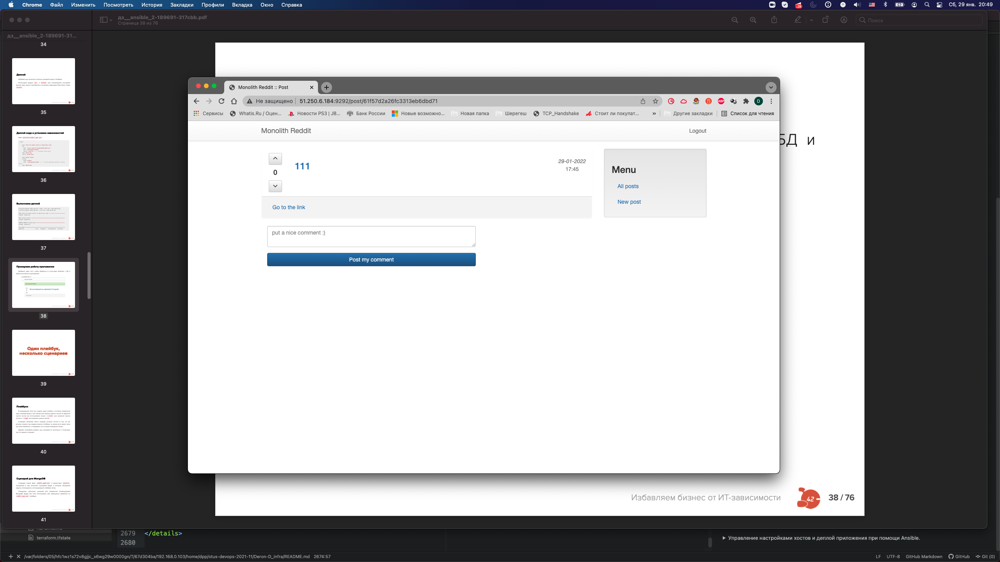

# **Лекция №4: Локальное окружение инженера. ChatOps и визуализация рабочих процессов. Командная работа с Git. Работа в GitHub**
> _play-travis_
<details>
  <summary>Настройка локального окружения и практика ChatOps</summary>

## **Задание:**
Настройка локального окружения и практика ChatOps.

Цель:
В данном дз студент продолжает знакомство в GIT. Студент настроит репозиторий, сделает интеграцию с Travic CI и Slack.
В данном задании тренируются навыки: работы с GIT, настройки интеграций с различными источниками.

Все действия описаны в методическом указании.

Критерии оценки:
0 б. - задание не выполнено
1 б. - задание выполнено
2 б. - выполнены все дополнительные задания

---

## **Выполнено:**
1. Клонирование своего репозитория
```
git clone git@github.com:Otus-DevOps-2021-11/Deron-D_infra.git
```

2. Работа с ветками
```
cd Deron-D_infra
git checkout -b play-travis
```

3. Добавление изменений. Функционал Pull Request Templates.
```
mkdir .github
cd .github
wget http://bit.ly/otus-pr-template -O PULL_REQUEST_TEMPLATE.md
cd ..
```
4. Добавим функционал хука pre-commit

- Выполним команды
```
curl https://bootstrap.pypa.io/get-pip.py -o get-pip.py & python3 get-pip.py
sudo pip3 install pre-commit
```

- Создадим в репозитории файл [.pre-commit-config.yaml](.pre-commit-config.yaml) со следующим содержимым
```
repos:
-   repo: https://github.com/pre-commit/pre-commit-hooks
    rev: v2.3.0
    hooks:
    -   id: end-of-file-fixer
    -   id: trailing-whitespace
```
- Выполним команду
```
pre-commit install
pre-commit installed at .git/hooks/pre-commit
```

5. Отправим изменения:
```
git add .
git commit -am 'Add PR template'
git push --set-upstream origin play-travis
```
6. Настройка интеграций используемых сервисов с чатом

- Создадим канал [#dmitriy_pnev](https://devops-team-otus.slack.com/archives/CN8RWNKQR)

- Интеграция с GitHub
Наберем в своем канале Slack команду-сообщение:
```
/github subscribe Otus-DevOps-2021-11/Deron-D_infra commits:*
```

- Тестируем интеграцию
```
mkdir play-travis
cd play-travis
wget https://raw.githubusercontent.com/express42/otus-snippets/master/hw-04/test.py
cd ..
```

- Правим ошибку в test.py
```
sed -i 's/self.assertEqual(1 + 1, 1)/self.assertEqual(1 + 1, 2)/' play-travis/test.py
```

- Сделаем коммит этого файла в ветку play-travis нашего  репозитория на GitHub
```
git status
git add .
git commit -am 'Add test.py'
git push --set-upstream origin play-travis
```
- Проверяем, что в наш канал [#dmitriy_pnev](https://devops-team-otus.slack.com/archives/CN8RWNKQR) приходят уведомления о новых коммитах

7. Настройка функционала Github Actions
```
mkdir -p .github/workflows/
cd .github/workflows/
wget https://raw.githubusercontent.com/Otus-DevOps-2020-11/.github/main/workflow-templates/auto-assign.yml
wget https://gist.githubusercontent.com/mrgreyves/43311631626a5f0b471dff45203c52e2/raw/5f3fb777607d335852084c2c9a5a0f52773cf4e8/run-tests.yml
cd ..
wget https://gist.githubusercontent.com/mrgreyves/d8815bcb7e00a2f0b26d0e0a48c5563b/raw/f4a76a7842f6c7cd5e428db6b33938fb1dffcbf4/auto_assign.yml
```


## **Полезное:**
</details>

# **Лекция №5: Знакомство с облачной инфраструктурой Yandex.Cloud**
> _cloud-bastion_
<details>
  <summary>Знакомство с облачной инфраструктурой</summary>

## **Задание:**
Запуск VM в Yandex Cloud, управление правилами фаервола, настройка SSH подключения, настройка SSH подключения через Bastion Host, настройка $

Цель:
В данном дз студент создаст виртуальные машины в Yandex.Cloud. Настроит bastion host и ssh. В данном задании тренируются навыки: создания ви$

Все действия описаны в методическом указании.

Критерии оценки:
0 б. - задание не выполнено 1 б. - задание выполнено 2 б. - выполнены все дополнительные задания

bastion_IP = 84.252.136.193
someinternalhost_IP = 10.129.0.25
---

## **Выполнено:**
1. Создаем инстансы VM bastion и someinternalhost через веб-морду Yandex.Cloud

2. Генерим пару ключей
```bash
ssh-keygen -t rsa -f ~/.ssh/appuser -C appuser -P ""
```

3. Проверяем подключение по полученному внешнему адресу
```bash
➜  Deron-D_infra git:(cloud-bastion) ssh -i ~/.ssh/appuser appuser@84.252.136.193
The authenticity of host '84.252.136.193 (84.252.136.193)' can't be established.
ECDSA key fingerprint is SHA256:ZiHfHm3LdK0MGjvw30kTB9a3IMfem/fBmX7S3BcVprI.
Are you sure you want to continue connecting (yes/no/[fingerprint])? yes
Warning: Permanently added '84.252.136.193' (ECDSA) to the list of known hosts.
Welcome to Ubuntu 20.04.3 LTS (GNU/Linux 5.4.0-42-generic x86_64)

 * Documentation:  https://help.ubuntu.com
 * Management:     https://landscape.canonical.com
 * Support:        https://ubuntu.com/advantage

The programs included with the Ubuntu system are free software;
the exact distribution terms for each program are described in the
individual files in /usr/share/doc/*/copyright.

Ubuntu comes with ABSOLUTELY NO WARRANTY, to the extent permitted by
applicable law.

appuser@bastion:~$ exit
logout
Connection to 84.252.136.193 closed.
```

4. Пробуем зайти по SSH на bastionhost , а с него по внутреннему адресу на someinternalhost
```bash
➜  Deron-D_infra git:(cloud-bastion) ✗ ssh -i ~/.ssh/appuser appuser@84.252.136.193
Welcome to Ubuntu 20.04.3 LTS (GNU/Linux 5.4.0-42-generic x86_64)

 * Documentation:  https://help.ubuntu.com
 * Management:     https://landscape.canonical.com
 * Support:        https://ubuntu.com/advantage
Last login: Sun Dec 19 12:47:30 2021 from 82.194.224.170
appuser@bastion:~$ ping 10.129.0.25
PING 10.129.0.25 (10.129.0.25) 56(84) bytes of data.
64 bytes from 10.129.0.25: icmp_seq=1 ttl=63 time=1.11 ms
64 bytes from 10.129.0.25: icmp_seq=2 ttl=63 time=0.390 ms
^C
--- 10.129.0.25 ping statistics ---
2 packets transmitted, 2 received, 0% packet loss, time 1001ms
rtt min/avg/max/mdev = 0.390/0.751/1.113/0.361 ms
appuser@bastion:~$ ssh 10.129.0.25
The authenticity of host '10.129.0.25 (10.129.0.25)' can't be established.
ECDSA key fingerprint is SHA256:FlXAZUZ4ePBdhUANM+ZSCUHt3ZladtNOcYfHuHmxyKo.
Are you sure you want to continue connecting (yes/no/[fingerprint])? yes
Warning: Permanently added '10.129.0.25' (ECDSA) to the list of known hosts.
appuser@10.129.0.25: Permission denied (publickey).
```

5. Используем Bastion host для прямого подключения к инстансам внутренней сети:
- Настроим SSH Forwarding на нашей локальной машине:
```bash
➜  Deron-D_infra git:(cloud-bastion) ✗ ssh-add -L
Could not open a connection to your authenticati~/otus-devops/Deron-D_infra $ ssh-add ~/.ssh/appuser
Identity added: /home/dpp/.ssh/appuser (appuser)
 ~/otus-devops/Deron-D_infra $ eval $(ssh-agent -s)
Agent pid 1739595 on agent.
```
- Добавим приватный ключ в ssh агент авторизации:
```bash
➜  Deron-D_infra git:(cloud-bastion) ✗ ssh-add -L
The agent has no identities.
➜  Deron-D_infra git:(cloud-bastion) ✗ ssh-add ~/.ssh/appuser
Identity added: /home/dpp/.ssh/appuser (appuser)
```

- Проверяем прямое подключение:
➜  Deron-D_infra git:(cloud-bastion) ✗ ssh -i ~/.ssh/appuser -A appuser@84.252.136.193
Welcome to Ubuntu 20.04.3 LTS (GNU/Linux 5.4.0-42-generic x86_64)

 * Documentation:  https://help.ubuntu.com
 * Management:     https://landscape.canonical.com
 * Support:        https://ubuntu.com/advantage
Last login: Sun Dec 19 13:38:52 2021 from 82.194.224.170
appuser@bastion:~$ ssh 10.129.0.25
Welcome to Ubuntu 20.04.3 LTS (GNU/Linux 5.4.0-42-generic x86_64)

 * Documentation:  https://help.ubuntu.com
 * Management:     https://landscape.canonical.com
 * Support:        https://ubuntu.com/advantage

The programs included with the Ubuntu system are free software;
the exact distribution terms for each program are described in the
individual files in /usr/share/doc/*/copyright.

Ubuntu comes with ABSOLUTELY NO WARRANTY, to the extent permitted by
applicable law.

appuser@someinternalhost:~$ hostname
someinternalhost
appuser@someinternalhost:~$ ip a show eth0
2: eth0: <BROADCAST,MULTICAST,UP,LOWER_UP> mtu 1500 qdisc mq state UP group default qlen 1000
    link/ether d0:0d:cf:b3:c9:a7 brd ff:ff:ff:ff:ff:ff
    inet 10.129.0.25/24 brd 10.129.0.255 scope global eth0
       valid_lft forever preferred_lft forever
    inet6 fe80::d20d:cfff:feb3:c9a7/64 scope link
       valid_lft forever preferred_lft forever
```

- Проверим отсутствие каких-либо приватных ключей на bastion машине:
```
appuser@someinternalhost:~$ ls -la ~/.ssh/
total 12
drwx------ 2 appuser appuser 4096 Dec 19 13:01 .
drwxr-xr-x 4 appuser appuser 4096 Dec 19 13:58 ..
-rw------- 1 appuser appuser  561 Dec 19 13:01 authorized_keys
```

- Самостоятельное задание. Исследовать способ подключения к someinternalhost в одну команду из вашего рабочего устройства:

Добавим в ~/.ssh/config содержимое:
```bash
➜  Deron-D_infra git:(cloud-bastion) ✗ cat ~/.ssh/config
Host 84.252.136.193
  User appuser
  IdentityFile /home/dpp/.ssh/appuser
Host 10.129.0.25
  User appuser
  ProxyCommand ssh -W %h:%p 84.252.136.193
  IdentityFile /home/dpp/.ssh/appuser
```
- Проверяем работоспособность найденного решения:
```bash
➜  Deron-D_infra git:(cloud-bastion) ✗ ssh 10.129.0.25
The authenticity of host '10.129.0.25 (<no hostip for proxy command>)' can't be established.
ECDSA key fingerprint is SHA256:FlXAZUZ4ePBdhUANM+ZSCUHt3ZladtNOcYfHuHmxyKo.
Are you sure you want to continue connecting (yes/no/[fingerprint])? yes
Warning: Permanently added '10.129.0.25' (ECDSA) to the list of known hosts.
Welcome to Ubuntu 20.04.3 LTS (GNU/Linux 5.4.0-42-generic x86_64)

 * Documentation:  https://help.ubuntu.com
 * Management:     https://landscape.canonical.com
 * Support:        https://ubuntu.com/advantage
Failed to connect to https://changelogs.ubuntu.com/meta-release-lts. Check your Internet connection or proxy settings

Last login: Sun Dec 19 13:58:50 2021 from 10.129.0.34
```

- Дополнительное задание:

На локальной машине правим /etc/hosts
```bash
sudo bash -c 'echo "10.129.0.25 someinternalhost" >> /etc/hosts'
```

Добавим в ~/.ssh/config содержимое:
```bash
Host someinternalhost
  User appuser
  ProxyCommand ssh -W %h:%p 84.252.136.193
  IdentityFile /home/dpp/.ssh/appuser
```

Проверяем:
```
➜  Deron-D_infra git:(cloud-bastion) ✗ ssh someinternalhost
The authenticity of host 'someinternalhost (<no hostip for proxy command>)' can't be established.
ECDSA key fingerprint is SHA256:FlXAZUZ4ePBdhUANM+ZSCUHt3ZladtNOcYfHuHmxyKo.
Are you sure you want to continue connecting (yes/no/[fingerprint])? yes
Warning: Permanently added 'someinternalhost' (ECDSA) to the list of known hosts.
Welcome to Ubuntu 20.04.3 LTS (GNU/Linux 5.4.0-42-generic x86_64)

 * Documentation:  https://help.ubuntu.com
 * Management:     https://landscape.canonical.com
 * Support:        https://ubuntu.com/advantage
Failed to connect to https://changelogs.ubuntu.com/meta-release-lts. Check your Internet connection or proxy settings

Last login: Sun Dec 19 14:22:10 2021 from 10.129.0.34
```
- Создаем VPN-сервер для серверов Yandex.Cloud:

Создан скрипт установки VPN-сервера (setupvpn.sh)[./setupvpn.sh]

[Веб-интерфейс VPN-сервера Pritunl](https://84-252-136-193.sslip.io/#dashboard)


## **Полезное:**
- [SSH: подключение в приватную сеть через Bastion и немного про Multiplexing](https://rtfm.co.ua/ssh-podklyuchenie-v-privatnuyu-set-cherez-$
</details>


# **Лекция №6: Основные сервисы Yandex Cloud**
> _cloud-testapp_
<details>
  <summary>Практика управления ресурсами yandex cloud через yc.</summary>

## **Задание:**
Цель:
В данном дз произведет ручной деплой тестового приложения. Напишет bash скрипт для автоматизации задач настройки VM и деплоя приложения.
В данном задании тренируются навыки: деплоя приложения на сервер, написания bash скриптов.

Ручной деплой тестового приложения. Написание bash скриптов для автоматизации задач настройки VM и деплоя приложения.
Все действия описаны в методическом указании.

Критерии оценки:
0 б. - задание не выполнено
1 б. - задание выполнено
2 б. - выполнены все дополнительные задания

testapp_IP = 51.250.0.68
testapp_port = 9292

---

## **Выполнено:**
- Установлен YC CLI:
```bash
curl https://storage.yandexcloud.net/yandexcloud-yc/install.sh | bash
```

- Проверена работа YC CLI:
```bash
➜  Deron-D_infra git:(cloud-testapp) ✗ yc config list
token: AQA..
cloud-id: b1g...
folder-id: b1g...
compute-default-zone: ru-central1-a
➜  Deron-D_infra git:(cloud-testapp) ✗ yc config profile list
default ACTIVE
```

- Создан новый инстанс reddit-app [create_instance.sh](./create_instance.sh):
```bash
yc compute instance create \
 --name reddit-app \
 --hostname reddit-app \
 --memory=4 \
 --create-boot-disk image-folder-id=standard-images,image-family=ubuntu-1604-lts,size=10GB \
 --network-interface subnet-name=default-ru-central1-a,nat-ip-version=ipv4 \
 --metadata serial-port-enable=1 \
 --ssh-key ~/.ssh/appuser.pub
```

- Установлен Ruby [install_ruby.sh](./install_ruby.sh):
```
#!/bin/bash
sudo apt update
sudo apt install -y ruby-full ruby-bundler build-essential
```

- Проверен Ruby и Bundler:
```
$ ruby -v
ruby 2.3.1p112 (2016-04-26) [x86_64-linux-gnu]
$ bundler -v
Bundler version 1.11.2
```

- Установлен и запущен MongoDB [install_mongodb.sh](./install_mongodb.sh):
```
wget -qO - https://www.mongodb.org/static/pgp/server-4.2.asc | sudo apt-key add -
echo "deb [ arch=amd64,arm64 ] https://repo.mongodb.org/apt/ubuntu xenial/mongodb-org/4.2 multiverse" | sudo tee /etc/apt/sources.list.d/mongodb-org-4.2.list

sudo apt-get update
sudo apt-get install -y apt-transport-https ca-certificates

sudo apt-get update
sudo apt-get install -y mongodb-org

sudo systemctl start mongod
sudo systemctl enable mongod
```

- Выполнен деплой приложения [deploy.sh](./deploy.sh):
```
sudo apt-get install -y git
git clone -b monolith https://github.com/express42/reddit.git
cd reddit && bundle install
```

- Дополнительное задание:

Для создания инстанса с развернутым приложением достаточно запустить:
```
yc compute instance create \
 --name reddit-app \
 --hostname reddit-app \
 --memory=4 \
 --create-boot-disk image-folder-id=standard-images,image-family=ubuntu-1604-lts,size=10GB \
 --network-interface subnet-name=default-ru-central1-a,nat-ip-version=ipv4 \
 --metadata-from-file user-data=metadata.yaml \
 --metadata serial-port-enable=1
```

Содержимое [metadata.yaml](./metadata.yaml):
```
#cloud-config
users:
  - default
  - name: yc-user
    groups: sudo
    shell: /bin/bash
    sudo: ['ALL=(ALL) NOPASSWD:ALL']
    ssh-authorized-keys:
      - "ssh-rsa AAAAB3NzaC1yc2EAAAADAQABAAABgQDUSGRF2QvKndsn1hbFv93CgS3/AiwCoETwjHL6Wzkyape+sW5EXKT/MXjCTlBVfqPtKWvY2pqXpEY7oJAOmJJrBvwnuod2SzEEoFncK1YOLXJOhzeXkT1+1cgo27jJYb4TQTWjawCYv48kJnPNwSL/jNLGQSdosfH3POQVWkB3xCjoLZ7/kMqZQbFEvol5BI5T0HM7uKtPJdWUPD0X1Jpu5MgFV6ZmSWWVrGY25nTehs0nTy4AkAv5mp8VJQtzpKu+fennhQdeb+8aGEaZkFNUOGFAf9ph0G4Lq/gks491Un7cL1/HvcRgPvDdqS+ZRKaPopqK/f978VkpzovlZNJWERZyTrzbgkme6x88zv+rWUu3DiWhldGNuBdghA2kOGhSpSX80gLlj8yE3IP8pdveOq10OztLVpy+8j7tSegOdU9QnBNZ/wqgSVa9kWCU/fui4ASDAA4IAWtthUkaqmDdSPM8mPv8KYueR75LOPKMCCclAOz8S8LK1kFRwcJVEs8= appuser"

runcmd:
  - wget https://raw.githubusercontent.com/Otus-DevOps-2021-11/Deron-D_infra/cloud-testapp/bootstrap.sh
  - bash bootstrap.sh
```

Содержимое [bootstrap.sh](./bootstrap.sh):
```
#!/bin/bash
wget -qO - https://www.mongodb.org/static/pgp/server-4.2.asc | sudo apt-key add -
echo "deb [ arch=amd64,arm64 ] https://repo.mongodb.org/apt/ubuntu xenial/mongodb-org/4.2 multiverse" | sudo tee /etc/apt/sources.list.d/mongodb-org-4.2.list
sudo apt-get update
sudo apt-get install -y apt-transport-https ca-certificates ruby-full ruby-bundler build-essential mongodb-org git
sudo systemctl --now enable mongod
git clone -b monolith https://github.com/express42/reddit.git
cd reddit && bundle install
puma -d
```

# **Полезное:**
</details>

# **Лекция №7: Модели управления инфраструктурой. Подготовка образов с помощью Packer**
> _packer-base_
<details>
  <summary>Подготовка базового образа VM при помощи Packer</summary>

## **Задание:**
Подготовка базового образа VM при помощи Packer.

Цель:
В данном дз студент произведет сборку готового образа с уже установленным приложением при помощи Packer. Задеплоит приложение в Yandex compute cloud при помощи ранее подготовленного образа.
В данном задании тренируются навыки: работы с Packer, работы с YC.

Все действия описаны в методическом указании.

Критерии оценки:
0 б. - задание не выполнено
1 б. - задание выполнено
2 б. - выполнены все дополнительные задания

---

## **Выполнено:**

1. Установлен Packer:

```bash
sudo yum install -y yum-utils
sudo yum-config-manager --add-repo https://rpm.releases.hashicorp.com/RHEL/hashicorp.repo
sudo yum -y install packer
➜  Deron-D_infra git:(packer-base) packer -v
1.7.8
```

2.1. Создан сервисный аккаунт:
```bash
SVC_ACCT="svcuser"
FOLDER_ID=$(yc config list | grep folder-id | cut -d ' ' -f 2)
➜  Deron-D_infra git:(packer-base) yc iam service-account create --name $SVC_ACCT --folder-id $FOLDER_ID
id: aje0m03rhn6s1lq4un9a
folder_id: b1gu87e4thvariradsue
created_at: "2021-12-30T21:37:09.317555534Z"
name: svcuser
```

2.2. Делегированы права editor сервисному аккаунту для Packer
```bash
ACCT_ID=$(yc iam service-account get $SVC_ACCT | grep ^id | awk '{print $2}')
➜  Deron-D_infra git:(packer-base) ✗ yc resource-manager folder add-access-binding --id $FOLDER_ID --role editor --service-account-id $ACCT_ID
done (1s)
```

2.3. Создан service account key file
```bash
➜  Deron-D_infra git:(packer-base) ✗ yc iam key create --service-account-id $ACCT_ID --output ~/.yc_keys/key.json
id: ajeovakc635hscjpiv3t
service_account_id: aje0m03rhn6s1lq4un9a
created_at: "2022-01-02T17:00:57.913576072Z"
key_algorithm: RSA_2048

➜  Deron-D_infra git:(packer-base) ✗ ll ~/.yc_keys
итого 8,0K
-rw-------. 1 dpp dpp 2,4K янв  2 20:00 key.json
```

3. Создан файла-шаблона Packer [ubuntu16.json](https://raw.githubusercontent.com/Otus-DevOps-2021-11/Deron-D_infra/packer-base/packer/ubuntu16.json)

4. Созданы скрипты для provisioners [install_ruby.sh](https://raw.githubusercontent.com/Otus-DevOps-2021-11/Deron-D_infra/packer-base/packer/scripts/install_ruby.sh);[install_mongodb.sh](https://raw.githubusercontent.com/Otus-DevOps-2021-11/Deron-D_infra/packer-base/packer/scripts/install_mongodb.sh)

5. Выполнено параметризирование шаблона с применением [variables.json.example](https://raw.githubusercontent.com/Otus-DevOps-2021-11/Deron-D_infra/packer-base/packer/variables.json.example)

6. Выполнена проверка на ошибки
```bash
➜  packer git:(packer-base) ✗ packer validate -var-file=./variables.json ./ubuntu16.json
The configuration is valid.
```

7. Произведен запуск сборки образа
```bash
packer build -var-file=./variables.json ./ubuntu16.json
```

8. Создана ВМ с использованием созданного образа

9. Выполнено "дожаривание" ВМ для запуска приложения:
```bash
sudo apt-get update
sudo apt-get install -y git
git clone -b monolith https://github.com/express42/reddit.git
cd reddit && bundle install
puma -d
```

10. Построение bake-образа `*`
- Создан [immutable.json](https://raw.githubusercontent.com/Otus-DevOps-2021-11/Deron-D_infra/packer-base/packer/immutable.json)
- Создан systemd unit [puma.service](https://raw.githubusercontent.com/Otus-DevOps-2021-11/Deron-D_infra/packer-base/packer/files/puma.service)
- Запущена сборка
```
packer build -var-file=./variables.json immutable.json
```
- Проверка созданных образов:
```bash
➜  packer git:(packer-base) ✗ yc compute image list
+----------------------+------------------------+-------------+----------------------+--------+
|          ID          |          NAME          |   FAMILY    |     PRODUCT IDS      | STATUS |
+----------------------+------------------------+-------------+----------------------+--------+
| fd8h54ao679l7j00kmi7 | reddit-base-1641146829 | reddit-base | f2eprbl75mtak72k76c5 | READY  |
| fd8vb8lcmbe116i8umkc | reddit-full-1641149015 | reddit-full | f2eprbl75mtak72k76c5 | READY  |
+----------------------+------------------------+-------------+----------------------+--------+
```

11. Автоматизация создания ВМ `*`
- Создан [create-reddit-vm.sh](./config-scripts/create-reddit-vm.sh)


# **Полезное:**
</details>

# **Лекция №8: Знакомство с Terraform**
> _terraform-1_
<details>
 <summary>Знакомство с Terraform</summary>

## **Задание:**
Декларативное описание в виде кода инфраструктуры YC, требуемой для запуска тестового приложения, при помощи Terraform.

Цель:
В данном дз студент опишет всю инфраструктуру в Yandex Cloud при помощи Terraform.
В данном задании тренируются навыки: создания и описания инфраструктуры при помощи Terraform. Принципы и подходы IaC.

Все действия описаны в методическом указании.

Критерии оценки:
0 б. - задание не выполнено
1 б. - задание выполнено
2 б. - выполнены все дополнительные задания

---

## **Выполнено:**
1. Установлен terraform 0.12.8 с помощью [terraform-switcher](https://github.com/warrensbox/terraform-switcher)

```bash
curl -L https://raw.githubusercontent.com/warrensbox/terraform-switcher/release/install.sh | sudo bash

➜  Deron-D_infra git:(terraform-1) ✗ tfswitch
Use the arrow keys to navigate: ↓ ↑ → ←
? Select Terraform version:
  ▸ 0.12.8 *recent

terraform git:(terraform-1) ✗ terraform -v
Terraform v0.12.8
```

2. В корне репозитория дополнили файл [.gitignore](https://github.com/Otus-DevOps-2021-11/Deron-D_infra/blob/terraform-1/.gitignore) содержимым:

```github
*.tfstate
*.tfstate.*.backup
*.tfstate.backup
*.tfvars
.terraform/
```

3. Узнаем свои параметры токена, идентификатора облака и каталога:

```bash
yc config list
➜  Deron-D_infra git:(terraform-1) ✗ yc config list
token: <OAuth или статический ключ сервисного аккаунта>
cloud-id: <идентификатор облака>
folder-id: <идентификатор каталога>
compute-default-zone: ru-central1-a
```

4. Создадим сервисный аккаунт для работы terraform:

```bash
FOLDER_ID=$(yc config list | grep folder-id | awk '{print $2}')
SRV_ACC=trfuser

yc iam service-account create --name $SRV_ACC --folder-id $FOLDER_ID

SRV_ACC_ID=$(yc iam service-account get $SRV_ACC | grep ^id | awk '{print $2}')

yc resource-manager folder add-access-binding --id $FOLDER_ID --role editor --service-account-id $SRV_ACC_ID

yc iam key create --service-account-id $SRV_ACC_ID --output ~/.yc_keys/key.json
```

5. Смотрим информацию о имени, семействе и id пользовательских образов своего каталога с помощью команды yc compute image list:

```bash
➜  Deron-D_infra git:(terraform-1) yc compute image list
+----------------------+------------------------+-------------+----------------------+--------+
|          ID          |          NAME          |   FAMILY    |     PRODUCT IDS      | STATUS |
+----------------------+------------------------+-------------+----------------------+--------+
| fd8190armqc6lvi7l8bq | reddit-base-1641220903 | reddit-base | f2ejt2v5v2gt4lfcs9gb | READY  |
+----------------------+------------------------+-------------+----------------------+--------+
```

6. Cмотрим информацию о имени и id сети; подсетей своего каталога с помощью команд yc vpc network list; yc vpc subnet list:

```bash
➜  Deron-D_infra git:(terraform-1) ✗ yc vpc network list
+----------------------+--------+
|          ID          |  NAME  |
+----------------------+--------+
| enpf84mr5ho6p6299th2 | my-net |
+----------------------+--------+

➜  Deron-D_infra git:(terraform-1) ✗ yc vpc subnet list
+----------------------+----------------------+----------------------+----------------+---------------+-----------------+
|          ID          |         NAME         |      NETWORK ID      | ROUTE TABLE ID |     ZONE      |      RANGE      |
+----------------------+----------------------+----------------------+----------------+---------------+-----------------+
| b0c5fukgbccn94q1o2ja | my-net-ru-central1-c | enpf84mr5ho6p6299th2 |                | ru-central1-c | [10.130.0.0/24] |
| e2l35j160p54h8m8k41u | my-net-ru-central1-b | enpf84mr5ho6p6299th2 |                | ru-central1-b | [10.129.0.0/24] |
| e9bogf7vjavut5hrqrjl | my-net-ru-central1-a | enpf84mr5ho6p6299th2 |                | ru-central1-a | [10.128.0.0/24] |
+----------------------+----------------------+----------------------+----------------+---------------+-----------------+
```

7. Правим main.tf до состояния:

```terraform
terraform {
  required_version = "0.12.8"
}

provider "yandex" {
  version                  = "0.35"
  service_account_key_file = pathexpand("~/.yc_keys/key.json")
  folder_id                = "b1gu87e4thvariradsue"
  zone                     = "ru-central1-a"
}

resource "yandex_compute_instance" "app" {
  name = "reddit-app"
  resources {
    cores  = 2
    memory = 2
  }
  boot_disk {
    initialize_params {
      # Указать id образа созданного в предыдущем домашнем задании
      image_id = "fd8190armqc6lvi7l8bq"
    }
  }
  network_interface {
    # Указан id подсети default-ru-central1-a
    subnet_id = "e9bogf7vjavut5hrqrjl"
    nat       = true
  }
}
```

8. Для того чтобы загрузить провайдер и начать его использовать выполняем следующую команду в
директории terraform:

```bash
terraform init
```

9. Планируем изменения:

```bash
➜  Deron-D_infra git:(terraform-1) ✗ terraform plan
Refreshing Terraform state in-memory prior to plan...
The refreshed state will be used to calculate this plan, but will not be
persisted to local or remote state storage.


------------------------------------------------------------------------

An execution plan has been generated and is shown below.
Resource actions are indicated with the following symbols:
  + create

Terraform will perform the following actions:

  # yandex_compute_instance.app will be created
  + resource "yandex_compute_instance" "app" {
      + created_at                = (known after apply)
      + folder_id                 = (known after apply)
      + fqdn                      = (known after apply)
      + hostname                  = (known after apply)
      + id                        = (known after apply)
      + name                      = "reddit-app"
      + network_acceleration_type = "standard"
      + platform_id               = "standard-v1"
      + service_account_id        = (known after apply)
      + status                    = (known after apply)
      + zone                      = (known after apply)

      + boot_disk {
          + auto_delete = true
          + device_name = (known after apply)
          + disk_id     = (known after apply)
          + mode        = (known after apply)

          + initialize_params {
              + description = (known after apply)
              + image_id    = "fd8190armqc6lvi7l8bq"
              + name        = (known after apply)
              + size        = (known after apply)
              + snapshot_id = (known after apply)
              + type        = "network-hdd"
            }
        }

      + network_interface {
          + index          = (known after apply)
          + ip_address     = (known after apply)
          + ipv6           = (known after apply)
          + ipv6_address   = (known after apply)
          + mac_address    = (known after apply)
          + nat            = true
          + nat_ip_address = (known after apply)
          + nat_ip_version = (known after apply)
          + subnet_id      = "enpf84mr5ho6p6299th2"
        }

      + resources {
          + core_fraction = 100
          + cores         = 2
          + memory        = 2
        }

      + scheduling_policy {
          + preemptible = (known after apply)
        }
    }

Plan: 1 to add, 0 to change, 0 to destroy.

------------------------------------------------------------------------

Note: You didn't specify an "-out" parameter to save this plan, so Terraform
can't guarantee that exactly these actions will be performed if
"terraform apply" is subsequently run.
```

10. Создаем VM согласно описанию в манифесте main.tf:

```bash
➜  terraform git:(terraform-1) terraform apply -auto-approve
yandex_compute_instance.app: Creating...
yandex_compute_instance.app: Still creating... [10s elapsed]
yandex_compute_instance.app: Still creating... [20s elapsed]
yandex_compute_instance.app: Still creating... [30s elapsed]
yandex_compute_instance.app: Still creating... [40s elapsed]
yandex_compute_instance.app: Creation complete after 44s [id=fhmlc5re13c4l7j3pu5k]

Apply complete! Resources: 1 added, 0 changed, 0 destroyed.
```

11. Смотрим внешний IP адрес созданного инстанса,
```bash
Deron-D_infra git:(terraform-1) ✗ terraform show | grep nat_ip_address
        nat_ip_address = "62.84.119.129"
```

12. Пробуем подключиться по SSH:
```bash
➜  Deron-D_infra git:(terraform-1) ✗ ssh ubuntu@62.84.119.129
The authenticity of host '62.84.119.129 (62.84.119.129)' can't be established.
ECDSA key fingerprint is SHA256:EYLFosa66FgTBPXzrhuv1dMhZxZzDoISvtx1hWiGVks.
Are you sure you want to continue connecting (yes/no/[fingerprint])? yes
Warning: Permanently added '62.84.119.129' (ECDSA) to the list of known hosts.
ubuntu@62.84.119.129's password:

```

13. Нужно определить SSH публичный ключ пользователя ubuntu в метаданных нашего инстанса добавив в main.tf:
```terraform
metadata = {
ssh-keys = "ubuntu:${file("~/.ssh/appuser.pub")}"
}
```

14. Проверяем:

```bash
ssh ubuntu@62.84.119.129 -i ~/.ssh/appuser -o StrictHostKeyChecking=no
@@@@@@@@@@@@@@@@@@@@@@@@@@@@@@@@@@@@@@@@@@@@@@@@@@@@@@@@@@@
@    WARNING: REMOTE HOST IDENTIFICATION HAS CHANGED!     @
@@@@@@@@@@@@@@@@@@@@@@@@@@@@@@@@@@@@@@@@@@@@@@@@@@@@@@@@@@@
IT IS POSSIBLE THAT SOMEONE IS DOING SOMETHING NASTY!
Someone could be eavesdropping on you right now (man-in-the-middle attack)!
It is also possible that a host key has just been changed.
The fingerprint for the ECDSA key sent by the remote host is
SHA256:oSlrlVZN4mfxcXIho/FezIPb3xXjMKJwX5E+85+wawI.
Please contact your system administrator.
Add correct host key in /home/dpp/.ssh/known_hosts to get rid of this message.
Offending ECDSA key in /home/dpp/.ssh/known_hosts:11
Password authentication is disabled to avoid man-in-the-middle attacks.
Keyboard-interactive authentication is disabled to avoid man-in-the-middle attacks.
Welcome to Ubuntu 16.04.7 LTS (GNU/Linux 4.4.0-142-generic x86_64)
* Documentation:  https://help.ubuntu.com
* Management:     https://landscape.canonical.com
* Support:        https://ubuntu.com/advantage
```

15. Создадим файл outputs.tf для управления выходными переменными с содержимым:
```terraform
output "external_ip_address_app" {
  value = yandex_compute_instance.app.network_interface.0.nat_ip_address
}
```

16. Проверяем работоспособность outputs.tf:

```bash
➜  Deron-D_infra git:(terraform-1) ✗ terraform refresh
yandex_compute_instance.app: Refreshing state... [id=fhm08gs8ma628cvngi7m]

Outputs:

external_ip_address_app = 62.84.115.191
```

17. Добавляем provisioners в main.tf:

```terraform
provisioner "file" {
  source = "files/puma.service"
  destination = "/tmp/puma.service"
}

provisioner "remote-exec" {
script = "files/deploy.sh"
}
```

18. Создадим файл юнита для провижионинга [puma.service](https://github.com/Otus-DevOps-2021-11/Deron-D_infra/blob/terraform-1/terraform/files/puma.service)

19. Добавляем секцию для определения паметров подключения привиженеров:

```hcl
connection {
  type = "ssh"
  host = yandex_compute_instance.app.network_interface.0.nat_ip_address
  user = "ubuntu"
  agent = false
  # путь до приватного ключа
  private_key = file("~/.ssh/appuser")
  }
```

20. Проверяем работу провижинеров. Говорим terraform'y пересоздать ресурс VM при следующем
применении изменений:

```bash
➜  terraform git:(terraform-1) ✗ terraform taint yandex_compute_instance.app
Resource instance yandex_compute_instance.app has been marked as tainted.
```

21. Планируем и применяем изменения:

```bash
terraform plan
➜  Deron-D_infra git:(terraform-1) ✗ terraform taint yandex_compute_instance.app
Resource instance yandex_compute_instance.app has been marked as tainted.
➜  Deron-D_infra git:(terraform-1) ✗ terraform apply --auto-approve
yandex_compute_instance.app: Refreshing state... [id=fhm8qlanghmene5ijacb]
```


22. Проверяем результат изменений и работу приложения:

```bash
yandex_compute_instance.app: Creation complete after 2m33s [id=fhmsrsarg9tokee2dl8l]

Apply complete! Resources: 1 added, 0 changed, 1 destroyed.

Outputs:

external_ip_address_app = 51.250.12.59
terraform apply --auto-approve
```

23. Параметризируем конфигурационные файлы с помощью входных переменных:
- Создадим для этих целей еще один конфигурационный файл [variables.tf](https://github.com/Otus-DevOps-2021-11/Deron-D_infra/blob/terraform-1/terraform/variables.tf)

- Определим соответствующие параметры ресурсов main.tf через переменные:

```terraform
provider "yandex" {
  service_account_key_file = var.service_account_key_file
  cloud_id = var.cloud_id
  folder_id = var.folder_id
  zone = var.zone
}
```

```terraform
boot_disk {
  initialize_params {
    # Указать id образа созданного в предыдущем домашем задании
    image_id = var.image_id
  }
}

network_interface {
  # Указан id подсети default-ru-central1-a
  subnet_id = var.subnet_id
  nat       = true
}

metadata = {
ssh-keys = "ubuntu:${file(var.public_key_path)}"
}
```

24. Определим переменные, используя специальный файл [terraform.tfvars](https://github.com/Otus-DevOps-2021-11/Deron-D_infra/blob/terraform-1/terraform/terraform.tfvars.example)

25. Форматирование и финальная проверка:

```bash
terraform fmt
terraform destroy
terraform plan
terraform apply --auto-approve
```

## **Проверка сервиса по адресу: [http://62.84.127.170:9292/](http://62.84.127.170:9292/)**
---

### Создание HTTP балансировщика `**`
1. Создадим файл lb.tf со следующим содержимым:

```terraform
resource "yandex_lb_target_group" "reddit_lb_target_group" {
  name      = "reddit-app-lb-group"
  region_id = var.region_id

  target {
    subnet_id = var.subnet_id
    address   = yandex_compute_instance.app.network_interface.0.ip_address
  }
}

resource "yandex_lb_network_load_balancer" "load_balancer" {
  name = "reddit-app-lb"

  listener {
    name = "reddit-app-listener"
    port = 80
    target_port = 9292
    external_address_spec {
      ip_version = "ipv4"
    }
  }

  attached_target_group {
    target_group_id = "${yandex_lb_target_group.reddit_lb_target_group.id}"

    healthcheck {
      name = "http"
      http_options {
        port = 9292
        path = "/"
      }
    }
  }
}
```

2. Добавляем в outputs.tf переменные адреса балансировщика и проверяем работоспособность решения:

```terraform
output "loadbalancer_ip_address" {
  value = yandex_lb_network_load_balancer.load_balancer.listener.*.external_address_spec[0].*.address
}
```

3. Добавляем в код еще один terraform ресурс для нового инстанса приложения (reddit-app2):
- main.tf

```terraform
resource "yandex_compute_instance" "app2" {
  name = "reddit-app2"
  resources {
    cores  = 2
    memory = 2
  }
...
  connection {
    type  = "ssh"
    host  = yandex_compute_instance.app2.network_interface.0.nat_ip_address
    user  = "ubuntu"
    agent = false
    # путь до приватного ключа
    private_key = file("~/.ssh/appuser")
  }
```

- lb.tf
```terraform
target {
  address = yandex_compute_instance.app2.network_interface.0.ip_address
  subnet_id = var.subnet_id
}
```

- outputs.tf

```terraform
output "external_ip_address_app2" {
  value = yandex_compute_instance.app2.network_interface.0.nat_ip_address
}
```

## **Проблемы в данной конфигурации:**
- Избыточный код
- На инстансах нет единого бэкэнда в части БД (mongodb)

3. Подход с заданием количества инстансов через параметр ресурса count:
- Добавим  в variables.tf

```terraform
variable count_of_instances {
  description = "Count of instances"
  default     = 1
}
```
- В main.tf удалим код для reddit-app2 и добавим:

```terraform
resource "yandex_compute_instance" "app" {
  name  = "reddit-app-${count.index}"
  count = var.count_of_instances
  resources {
    cores  = 2
    memory = 2
  }
...
connection {
  type  = "ssh"
  host  = self.network_interface.0.nat_ip_address
  user  = "ubuntu"
  agent = false
  # путь до приватного ключа
  private_key = file("~/.ssh/appuser")
}
```

- В lb.tf внесем изменения для динамического определения target:

```terraform
dynamic "target" {
  for_each = yandex_compute_instance.app.*.network_interface.0.ip_address
  content {
    subnet_id = var.subnet_id
    address   = target.value
  }
}
```

# **Полезное:**
- [Создать внутренний сетевой балансировщик](https://cloud.yandex.ru/docs/network-load-balancer/operations/internal-lb-create)
- [yandex_lb_network_load_balancer](https://registry.terraform.io/providers/yandex-cloud/yandex/0.44.0/docs/resources/lb_network_load_balancer)
- [yandex_lb_target_group](https://registry.terraform.io/providers/yandex-cloud/yandex/0.44.0/docs/resources/lb_target_group)
- [dynamic Blocks](https://www.terraform.io/docs/language/expressions/dynamic-blocks.html)
- [HashiCorp Terraform 0.12 Preview: For and For-Each](https://www.hashicorp.com/blog/hashicorp-terraform-0-12-preview-for-and-for-each)

</details>


# **Лекция №9: Принципы организации инфраструктурного кода и работа над инфраструктурой в команде на примере Terraform**
> _terraform-2_
<details>
 <summary>Работа с Terraform в команде</summary>

## **Задание:**
Создание Terraform модулей для управления компонентами инфраструктуры.

Цель:
В данном дз студент продолжит работать с Terraform. Опишет и произведет настройку нескольких окружений при помощи Terraform. Настроит remote backend.
В данном задании тренируются навыки: работы с Terraform, использования внешних хранилищ состояния инфраструктуры.

Описание и настройка инфраструктуры нескольких окружений. Работа с Terraform remote backend.

Критерии оценки:
0 б. - задание не выполнено
1 б. - задание выполнено
2 б. - выполнены все дополнительные задания

---

## **Выполнено:**
1. Создаем новую ветку в инфраструктурном репозитории и подчищаем результаты заданий со ⭐:

```bash
git checkout -b terraform-2
git mv terraform/lb.tf terraform/files/
```

2. Зададим IP для инстанса с приложением в виде внешнего ресурса, добавив в `main.tf`:

```hcl
resource "yandex_vpc_network" "app-network" {
  name = "reddit-app-network"
}
resource "yandex_vpc_subnet" "app-subnet" {
  name           = "reddit-app-subnet"
  zone           = "ru-central1-a"
  network_id     = "${yandex_vpc_network.app-network.id}"
  v4_cidr_blocks = ["192.168.10.0/24"]
}
```

- также добавим в 'main.tf' ссылку на внешний ресурс:

```hcl
network_interface {
  subnet_id = yandex_vpc_subnet.app-subnet.id
  nat = true
}
```

3. Применим изменения
```bash
➜  terraform git:(terraform-2) ✗ terraform destroy
➜  terraform git:(terraform-2) ✗ terraform apply --auto-approve
yandex_vpc_network.app-network: Creating...
yandex_vpc_network.app-network: Creation complete after 1s [id=enpg13juslvurvb9ubr9]
yandex_vpc_subnet.app-subnet: Creating...
yandex_vpc_subnet.app-subnet: Creation complete after 1s [id=e9be27mnk49np70ijone]
yandex_compute_instance.app[0]: Creating...
```

Видим, что ресурс VM начал создаваться только после
завершения создания yandex_vpc_subnet в результате неявной зависимости этих ресурсов.

4. Создание раздельных образов для инстансов app и db с помощью Packer:

В директории packer, где содержатся ваши шаблоны для билда VM, создадим два новых шаблона [db.json](https://github.com/Otus-DevOps-2021-11/Deron-D_infra/blob/terraform-2/packer/db.json) и [app.json](https://github.com/Otus-DevOps-2021-11/Deron-D_infra/blob/terraform-2/packer/app.json).

В качестве базового шаблона используем уже имеющийся шаблон ubuntu16.json, корректирую только соответствующие секции с наименованиями образов и секциями провизионеров.
~~~bash
cd packer
packer build -var-file=./variables.json ./db.json
packer build -var-file=./variables.json ./app.json
~~~


5. Создадим две VM

Разобьем конфиг `main.tf` на несколько конфигов
Создадим файл `app.tf`, куда вынесем конфигурацию для VM с приложением:
~~~hcl
resource "yandex_compute_instance" "app" {
  name = "reddit-app"

  labels = {
    tags = "reddit-app"
  }
  resources {
    cores  = 2
    memory = 2
  }

  boot_disk {
    initialize_params {
      image_id = var.app_disk_image
    }
  }

  network_interface {
    subnet_id = yandex_vpc_subnet.app-subnet.id
    nat = true
  }

  metadata = {
  ssh-keys = "ubuntu:${file(var.public_key_path)}"
  }
}
~~~

И создадим файл `db.tf`, куда вынесем конфигурацию для VM с приложением:
~~~hcl
resource "yandex_compute_instance" "db" {
  name = "reddit-db"
  labels = {
    tags = "reddit-db"
  }

  resources {
    cores  = 2
    memory = 2
  }

  boot_disk {
    initialize_params {
      image_id = var.db_disk_image
    }
  }

  network_interface {
    subnet_id = yandex_vpc_subnet.app-subnet.id
    nat = true
  }

  metadata = {
  ssh-keys = "ubuntu:${file(var.public_key_path)}"
  }
}
~~~

Не забудем объявить соответствующие переменные для образов приложения и базы данных в `variables.tf`:

~~~hcl
variable app_disk_image {
  description = "Disk image for reddit app"
  default = "reddit-app-base"
}
variable db_disk_image {
  description = "Disk image for reddit db"
  default = "reddit-db-base"
}
~~~

Создадим файл `vpc.tf`, в который вынесем конфигурацию сети и подсети, которое применимо для всех инстансов нашей сети.
~~~hcl
resource "yandex_vpc_network" "app-network" {
  name = "app-network"
}

resource "yandex_vpc_subnet" "app-subnet" {
  name           = "app-subnet"
  zone           = "ru-central1-a"
  network_id     = "${yandex_vpc_network.app-network.id}"
  v4_cidr_blocks = ["192.168.10.0/24"]
}
~~~

В итоге, в файле `main.tf` должно остаться только определение провайдера:
~~~hcl
provider "yandex" {
  version                  = 0.35
  service_account_key_file = var.service_account_key_file
  cloud_id                 = var.cloud_id
  folder_id                = var.folder_id
  zone                     = var.zone
}
~~~

Не забудем добавить nat адреса инстансов в `outputs.tf` переменные:
~~~hcl
output "external_ip_address_app" {
  value = yandex_compute_instance.app.network_interface.0.nat_ip_address
}
output "external_ip_address_db" {
  value = yandex_compute_instance.db.network_interface.0.nat_ip_address
}
~~~

```bash
t➜  terraform git:(terraform-2) ✗ terraform apply --auto-approve
yandex_vpc_network.app-network: Refreshing state... [id=enpolo5jf02oabepguhn]
yandex_vpc_subnet.app-subnet: Refreshing state... [id=e9bg6q0755m37i0q6994]
yandex_compute_instance.app: Creating...
yandex_compute_instance.db: Creating...
yandex_compute_instance.app: Still creating... [10s elapsed]
yandex_compute_instance.db: Still creating... [10s elapsed]
yandex_compute_instance.app: Still creating... [20s elapsed]
yandex_compute_instance.db: Still creating... [20s elapsed]
yandex_compute_instance.db: Still creating... [30s elapsed]
yandex_compute_instance.app: Still creating... [30s elapsed]
yandex_compute_instance.db: Still creating... [40s elapsed]
yandex_compute_instance.app: Still creating... [40s elapsed]
yandex_compute_instance.db: Creation complete after 45s [id=fhmb2p80u23caniggojr]
yandex_compute_instance.app: Still creating... [50s elapsed]
yandex_compute_instance.app: Still creating... [1m0s elapsed]
yandex_compute_instance.app: Creation complete after 1m3s [id=fhm3v1imfe15tibmvott]

Apply complete! Resources: 2 added, 0 changed, 0 destroyed.

Outputs:

external_ip_address_app = [
  "51.250.9.58",
]
external_ip_address_db = 62.84.115.41
```
Проверим доступность по SSH:
~~~bash
➜  terraform git:(terraform-2) ✗ ssh ubuntu@51.250.9.58 -i ~/.ssh/appuser
➜  terraform git:(terraform-2) ✗ ssh ubuntu@62.84.115.41 -i ~/.ssh/appuser
~~~

Удалим созданные ресурсы, используя terraform destroy
~~~bash
terraform destroy --auto-approve
~~~

6. Создание модулей

Внутри директории terraform создадим директорию modules, в которой мы будем определять модули.

Внутри директории modules создадим директорию db со следующими файлами:
`main.tf`
~~~hcl
resource "yandex_compute_instance" "db" {
  name = "reddit-db"
  labels = {
    tags = "reddit-db"
  }

  resources {
    cores  = 2
    memory = 2
  }

  boot_disk {
    initialize_params {
      # Указать id образа созданного в предыдущем домашем задании
      image_id = var.db_disk_image
    }
  }

  network_interface {
    subnet_id = var.subnet_id
    nat       = true
  }

  metadata = {
    ssh-keys = "ubuntu:${file(var.public_key_path)}"
  }

  connection {
    type  = "ssh"
    host  = self.network_interface.0.nat_ip_address
    user  = "ubuntu"
    agent = false
    # путь до приватного ключа
    private_key = file(var.private_key_path)
  }

  scheduling_policy {
    preemptible = true
  }
}
~~~

`variables.tf`
~~~hcl
variable public_key_path {
  description = "Path to the public key used for ssh access"
}
variable db_disk_image {
  description = "Disk image for reddit db"
  default     = "reddit-db-base"
}
variable subnet_id {
  description = "Subnets for modules"
}
variable private_key_path {
  description = "path to private key"
}
~~~

`outputs.tf`
~~~hcl
output "external_ip_address_db" {
  value = yandex_compute_instance.db.network_interface.0.nat_ip_address
}
~~~

Создадим по аналогии для модуля приложения директорию `modules\app` с содержимым
`main.tf`
~~~hcl
resource "yandex_compute_instance" "app" {
  name = "reddit-app"
  labels = {
    tags = "reddit-app"
  }

  resources {
    cores  = 2
    memory = 2
  }

  boot_disk {
    initialize_params {
      image_id = var.app_disk_image
    }
  }

  network_interface {
    subnet_id = var.subnet_id
    nat       = true
  }

  metadata = {
    ssh-keys = "ubuntu:${file(var.public_key_path)}"
  }

  connection {
    type  = "ssh"
    host  = self.network_interface.0.nat_ip_address
    user  = "ubuntu"
    agent = false
    # путь до приватного ключа
    private_key = file(var.private_key_path)
  }

  scheduling_policy {
    preemptible = true
  }

  provisioner "file" {
    source      = "files/puma.service"
    destination = "/tmp/puma.service"
  }

  provisioner "remote-exec" {
    script = "files/deploy.sh"
  }
}
~~~

`variables.tf`
~~~hcl
variable public_key_path {
  description = "Path to the public key used for ssh access"
}
variable app_disk_image {
  description = "Disk image for reddit app"
  default     = "reddit-app-base"
}
variable subnet_id {
  description = "Subnets for modules"
}
variable private_key_path {
  description = "path to private key"
}
~~~

`outputs.tf`
~~~hcl
output "external_ip_address_app" {
  value = yandex_compute_instance.app.network_interface.0.nat_ip_address
}
~~~


В файл `main.tf`, где у нас определен провайдер вставим секции вызова созданных нами модулей
~~~hcl
provider "yandex" {
  version                  = "0.35"
  service_account_key_file = var.service_account_key_file
  cloud_id                 = var.cloud_id
  folder_id                = var.folder_id
  zone                     = var.zone
}

data "yandex_compute_image" "app_image" {
  name = var.app_disk_image
}

data "yandex_compute_image" "db_image" {
  name = var.db_disk_image
}

module "app" {
  source          = "./modules/app"
  public_key_path = var.public_key_path
  private_key_path = var.private_key_path
  app_disk_image  = "${data.yandex_compute_image.app_image.id}"
  subnet_id       = var.subnet_id
}
module "db" {
  source          = "./modules/db"
  public_key_path = var.public_key_path
  private_key_path = var.private_key_path
  db_disk_image   = "${data.yandex_compute_image.db_image.id}"
  subnet_id       = var.subnet_id
}
~~~

Из папки terraform удаляем уже ненужные файлы app.tf, db.tf, vpc.tf и изменяем `outputs.tf`:
~~~hcl
output "external_ip_address_app" {
  value = module.app.external_ip_address_app
}
output "external_ip_address_db" {
  value = module.db.external_ip_address_db
}
~~~

Для использования модулей нужно сначала их загрузить из указанного источника `source`:
~~~bash
➜  terraform git:(terraform-2) ✗ terraform get
- app in modules/app
- db in modules/db
~~~

Планируем изменения:
~~~bash
➜  terraform git:(terraform-2) ✗ terraform plan
Refreshing Terraform state in-memory prior to plan...
The refreshed state will be used to calculate this plan, but will not be
persisted to local or remote state storage.

data.yandex_compute_image.db_image: Refreshing state...
data.yandex_compute_image.app_image: Refreshing state...
...
Plan: 2 to add, 0 to change, 0 to destroy.

------------------------------------------------------------------------

Note: You didn't specify an "-out" parameter to save this plan, so Terraform
can't guarantee that exactly these actions will be performed if
"terraform apply" is subsequently run.
~~~

После применения конфигурации с помощью terraform apply в соответствии с нашей конфигурацией проверяем SSH доступ ко обоим инстансам
Проверим доступность по SSH:
~~~bash
➜  terraform git:(terraform-2) ✗ ssh ubuntu@62.84.118.253 -i ~/.ssh/appuser
➜  terraform git:(terraform-2) ✗ ssh ubuntu@62.84.126.94 -i ~/.ssh/appuser
~~~

7. Переиспользование модулей
В директории terrafrom создадим две директории: stage и prod. Скопируем  файлы main.tf, variables.tf, outputs.tf, terraform.tfvars из директории terraform в каждую из созданных директорий.

Поменяем пути к модулям в main.tf на ../modules/xxx вместо ./modules/xxx в папках stage и prod.

Проверим правильность настроек инфраструктуры каждого окружения:
~~~bash
cd stage
terraform init
terraform plan
terraform apply --auto-approve
terraform destroy --auto-approve

cd ../prod
terraform init
terraform plan
terraform apply --auto-approve
terraform destroy --auto-approve
~~~

Отформатируем конфигурационные файлы, используя команду ` terraform fmt -recursive`


8. Настройка хранения стейт файла в удаленном бекенде. Задание со ⭐

~~~bash
➜  terraform git:(terraform-2) yc iam service-account list
+----------------------+---------+
|          ID          |  NAME   |
+----------------------+---------+
| aje0m03rhn6s1lq4un9a | svcuser |
| aje6upad8qvh1nri7dld | appuser |
| ajefutq36ihgrbitvbcc | tfuser  |
+----------------------+---------+

➜  terraform git:(terraform-2) yc iam access-key create --service-account-name tfuser
access_key:
  id: aje1q3g7cs038pcm84sr
  service_account_id: ajefutq36ihgrbitvbcc
  created_at: "2022-01-16T18:21:32.264929004Z"
  key_id: access-key
secret: secret-key
~~~

Соответственно заносим полученные данные в `variables.tf` и `terraform.tvars`

Планируем и вносим изменения в инфраструктуру:

~~~bash
➜  terraform git:(terraform-2) ✗ terraform plan
Refreshing Terraform state in-memory prior to plan...
The refreshed state will be used to calculate this plan, but will not be
persisted to local or remote state storage.


------------------------------------------------------------------------

An execution plan has been generated and is shown below.
Resource actions are indicated with the following symbols:
  + create

Terraform will perform the following actions:

  # yandex_storage_bucket.otus-storage-bucket will be created
  + resource "yandex_storage_bucket" "otus-storage-bucket" {
      + access_key         = "access-key"
      + acl                = "private"
      + bucket             = "deron-d"
      + bucket_domain_name = (known after apply)
      + force_destroy      = true
      + id                 = (known after apply)
      + secret_key         = (sensitive value)
      + website_domain     = (known after apply)
      + website_endpoint   = (known after apply)
    }

Plan: 1 to add, 0 to change, 0 to destroy.

------------------------------------------------------------------------

Note: You didn't specify an "-out" parameter to save this plan, so Terraform
can't guarantee that exactly these actions will be performed if
"terraform apply" is subsequently run.
...

~~~hcl
terraform {
  backend "s3" {
    endpoint   = "storage.yandexcloud.net"
    bucket     = "deron-d"
    region     = "ru-central1-a"
    key        = "terraform.tfstate"
    # access_key = var.access_key
    # secret_key = var.secret_key
    access_key = "access-key"
    secret_key = "secret-key"

    skip_region_validation      = true
    skip_credentials_validation = true
   }
}
~~~

Проверяем сохранение state VM's для каждого из окружений в bucket 'otus-bucket'
~~~bash
➜  stage pwd
/home/dpp/test/terraform/stage
➜  stage ll
итого 24K
-rw-r--r--. 1 dpp dpp  447 янв 16 23:07 backend.tf
-rw-r--r--. 1 dpp dpp  906 янв 16 19:30 main.tf
-rw-r--r--. 1 dpp dpp  161 янв 16 19:28 outputs.tf
-rw-r--r--. 1 dpp dpp  703 янв 16 22:14 terraform.tfvars
-rw-r--r--. 1 dpp dpp  358 янв 16 20:26 terraform.tfvars.example
-rw-r--r--. 1 dpp dpp 1,2K янв 16 21:28 variables.tf
➜  stage terraform init
Initializing modules...
- app in ../modules/app
- db in ../modules/db

Initializing the backend...

Successfully configured the backend "s3"! Terraform will automatically
use this backend unless the backend configuration changes.

Initializing provider plugins...
- Checking for available provider plugins...
- Downloading plugin for provider "yandex" (terraform-providers/yandex) 0.35.0...


Warning: registry.terraform.io: This version of Terraform has an outdated GPG key and is unable to verify new provider releases. Please upgrade Terraform to at least 0.12.31 to receive new provider updates. For details see: https://discuss.hashicorp.com/t/hcsec-2021-12-codecov-security-event-and-hashicorp-gpg-key-exposure/23512


Warning: registry.terraform.io: For users on Terraform 0.13 or greater, this provider has moved to yandex-cloud/yandex. Please update your source in required_providers.


Terraform has been successfully initialized!

You may now begin working with Terraform. Try running "terraform plan" to see
any changes that are required for your infrastructure. All Terraform commands
should now work.

If you ever set or change modules or backend configuration for Terraform,
rerun this command to reinitialize your working directory. If you forget, other
commands will detect it and remind you to do so if necessary.
➜  stage terraform apply -auto-approve
data.yandex_compute_image.app_image: Refreshing state...
data.yandex_compute_image.db_image: Refreshing state...
module.db.yandex_compute_instance.db: Creating...
module.app.yandex_compute_instance.app: Creating...
...

Apply complete! Resources: 2 added, 0 changed, 0 destroyed.

Outputs:

external_ip_address_app = 51.250.11.206
external_ip_address_db = 51.250.10.72
➜  stage cd ../prod
➜  prod terraform init
Initializing modules...
- app in ../modules/app
- db in ../modules/db

Initializing the backend...

Successfully configured the backend "s3"! Terraform will automatically
use this backend unless the backend configuration changes.

Initializing provider plugins...
- Checking for available provider plugins...
- Downloading plugin for provider "yandex" (terraform-providers/yandex) 0.35.0...


Warning: registry.terraform.io: This version of Terraform has an outdated GPG key and is unable to verify new provider releases. Please upgrade Terraform to at least 0.12.31 to receive new provider updates. For details see: https://discuss.hashicorp.com/t/hcsec-2021-12-codecov-security-event-and-hashicorp-gpg-key-exposure/23512


Warning: registry.terraform.io: For users on Terraform 0.13 or greater, this provider has moved to yandex-cloud/yandex. Please update your source in required_providers.


Terraform has been successfully initialized!

You may now begin working with Terraform. Try running "terraform plan" to see
any changes that are required for your infrastructure. All Terraform commands
should now work.

If you ever set or change modules or backend configuration for Terraform,
rerun this command to reinitialize your working directory. If you forget, other
commands will detect it and remind you to do so if necessary.
➜  prod terraform apply -auto-approve
data.yandex_compute_image.db_image: Refreshing state...
data.yandex_compute_image.app_image: Refreshing state...
module.db.yandex_compute_instance.db: Refreshing state... [id=fhma4s7c99lhip6t2k0q]
module.app.yandex_compute_instance.app: Refreshing state... [id=fhmh21hft03ojnhhkrgk]

Apply complete! Resources: 0 added, 0 changed, 0 destroyed.

Outputs:

external_ip_address_app = 51.250.11.206
external_ip_address_db = 51.250.10.72
~~~

9. Настройка provisioner. Задание со ⭐⭐

Добавим переменную на включения/отключения provisioner в `variables.tf` окружений stage|prod:
~~~hcl
variable enable_provision {
  description = "Enable provision"
  default = true
}
~~~

Добавляем в 'main.tf' для модулей app и db соответственно следующий код перед секцией connection:
~~~hcl
resource "null_resource" "app" {
  count = var.enable_provision ? 1 : 0
  triggers = {
    cluster_instance_ids = yandex_compute_instance.app.id
  }

...
resource "null_resource" "db" {
  count = var.enable_provision ? 1 : 0
  triggers = {
    cluster_instance_ids = yandex_compute_instance.db.id
  }
~~~

Добавляем передачу значений переменной enable_provision в секции вызова модуля 'main.tf'
~~~hcl
module "db|app" {
  ...
  enable_provision = var.enable_provision
  ...
~~~

# **Полезное:**

- [Публичный от HashiCorp реестр модулей для terraform](https://registry.terraform.io/)
- [Загрузка состояний Terraform в Object Storage](https://cloud.yandex.ru/docs/solutions/infrastructure-management/terraform-state-storage)
- [yandex_storage_bucket](https://registry.terraform.io/providers/yandex-cloud/yandex/latest/docs/resources/storage_bucket)
- [Provisioners Without a Resource](https://www.terraform.io/docs/language/resources/provisioners/null_resource.html)

</details>

# **Лекция №10: Управление конфигурацией. Знакомство с Ansible**
> _ansible-1_
<details>
 <summary>Написание Ansible плейбуков</summary>

## **Задание:**
Написание Ansible плейбуков на основе имеющихся bash скриптов.

Цель:
В данном дз студент познакомится с системой управления конфигурацией Ansible. Произведет сборку образа при помощи Ansible и Packer.
В данном задании тренируются навыки: работы с Ansible, работы с Packer.

Все действия описаны в методическом указании.

Критерии оценки:
0 б. - задание не выполнено
1 б. - задание выполнено
2 б. - выполнены все дополнительные задания

---

## **Выполнено:**

План
- Установка Ansible
- Знакомство с базовыми функциями и инвентори
- Выполнение различных модулей на подготовленной в прошлых ДЗ инфраструктуре
- Пишем простой плейбук

1.Установка Ansible

- Проверяем, что на рабочей машине установлен Python и Ansible
~~~bash
➜  ansible git:(ansible-1) python3 --version
Python 3.6.8
➜  ansible git:(ansible-1) ansible --version
ansible 2.9.18
  config file = /home/dpp/otus-devops-2021-11/Deron-D_infra/ansible/ansible.cfg
  configured module search path = ['/home/dpp/.ansible/plugins/modules', '/usr/share/ansible/plugins/modules']
  ansible python module location = /usr/lib/python3.6/site-packages/ansible
  executable location = /usr/bin/ansible
  python version = 3.6.8 (default, Aug 24 2020, 17:57:11) [GCC 8.3.1 20191121 (Red Hat 8.3.1-5)]
~~~

2. Знакомство с базовыми функциями и инвентори

- Поднимем инфраструктуру, описанную в окружении stage
~~~bash
➜  ansible git:(ansible-1) ✗ cd ../terraform/stage
➜  stage git:(ansible-1) ✗ terraform apply  -auto-approve
...
Apply complete! Resources: 4 added, 0 changed, 0 destroyed.
Outputs:
external_ip_address_app = 84.201.172.45
external_ip_address_db = 84.201.172.81
~~~

- Создадим инвентори файл `ansible/inventory`, в котором укажем информацию о созданном инстансе приложения и параметры подключения к нему по SSH:
~~~ini
[app]
appserver ansible_host=84.201.172.45

[db]
dbserver ansible_host=84.201.172.81
~~~

- Создадим файл `ansible.cfg` со следующим содержимым:
~~~
[defaults]
inventory = ./inventory
remote_user = ubuntu
private_key_file = ~/.ssh/appuser
host_key_checking = False
retry_files_enabled = False
~~~

- Убедимся, что Ansible может управлять нашими хостами:
~~~bash
➜  ansible git:(ansible-1) ✗ ansible all -m ping
dbserver | SUCCESS => {
    "ansible_facts": {
        "discovered_interpreter_python": "/usr/bin/python3"
    },
    "changed": false,
    "ping": "pong"
}
appserver | SUCCESS => {
    "ansible_facts": {
        "discovered_interpreter_python": "/usr/bin/python3"
    },
    "changed": false,
    "ping": "pong"
}
➜  ansible git:(ansible-1) ✗ ansible dbserver -m command -a uptime

dbserver | CHANGED | rc=0 >>
 11:34:24 up 22 min,  1 user,  load average: 0.01, 0.02, 0.00
➜  ansible git:(ansible-1) ✗ ansible app -m command -a uptime

appserver | CHANGED | rc=0 >>
 11:34:33 up 23 min,  1 user,  load average: 0.01, 0.01, 0.00
~~~


3. Выполнение различных модулей на подготовленной в прошлых ДЗ инфраструктуре

Проверим, что на app сервере установлены компоненты для работы приложения ( `ruby` и `bundler` ):
~~~bash
➜  ansible git:(ansible-1) ✗ ansible app -m command -a 'ruby -v'
appserver | CHANGED | rc=0 >>
ruby 2.3.1p112 (2016-04-26) [x86_64-linux-gnu]
➜  ansible git:(ansible-1) ✗ ansible app -m command -a 'bundler -v'
appserver | CHANGED | rc=0 >>
Bundler version 1.11.2
➜  ansible git:(ansible-1) ✗ ansible app -m command -a 'ruby -v; bundler -v'
appserver | FAILED | rc=1 >>
ruby: invalid option -;  (-h will show valid options) (RuntimeError)non-zero return code
➜  ansible git:(ansible-1) ✗ ansible app -m shell -a 'ruby -v; bundler -v'
appserver | CHANGED | rc=0 >>
ruby 2.3.1p112 (2016-04-26) [x86_64-linux-gnu]
Bundler version 1.11.2
~~~

- Проверим на хосте с БД статус сервиса MongoDB с помощью модуля`command` или `shell`
~~~bash
➜  ansible git:(ansible-1) ✗ ansible db -m command -a 'systemctl status mongod'
dbserver | CHANGED | rc=0 >>
● mongod.service - MongoDB Database Server
   Loaded: loaded (/lib/systemd/system/mongod.service; enabled; vendor preset: enabled)
   Active: active (running) since Sun 2022-01-23 11:11:45 UTC; 33min ago
     Docs: https://docs.mongodb.org/manual
 Main PID: 802 (mongod)
   CGroup: /system.slice/mongod.service
           └─802 /usr/bin/mongod --config /etc/mongod.conf

Jan 23 11:11:45 fhm3fvo47o9589v8bq4v systemd[1]: Started MongoDB Database Server.
➜  ansible git:(ansible-1) ✗ ansible db -m shell -a 'systemctl status mongod'
dbserver | CHANGED | rc=0 >>
● mongod.service - MongoDB Database Server
   Loaded: loaded (/lib/systemd/system/mongod.service; enabled; vendor preset: enabled)
   Active: active (running) since Sun 2022-01-23 11:11:45 UTC; 33min ago
     Docs: https://docs.mongodb.org/manual
 Main PID: 802 (mongod)
   CGroup: /system.slice/mongod.service
           └─802 /usr/bin/mongod --config /etc/mongod.conf

Jan 23 11:11:45 fhm3fvo47o9589v8bq4v systemd[1]: Started MongoDB Database Server.
~~~

- Тоже самое, но и применением модуля ansible `service`:
~~~bash
➜  ansible git:(ansible-1) ✗ ansible db -m service -a name=mongod
dbserver | SUCCESS => {
    "ansible_facts": {
        "discovered_interpreter_python": "/usr/bin/python3"
    },
    "changed": false,
    "name": "mongod",
    "status": {
        "ActiveEnterTimestamp": "Sun 2022-01-23 11:11:45 UTC",
        "ActiveEnterTimestampMonotonic": "18376233",
        "ActiveExitTimestamp": "Sun 2022-01-23 11:11:45 UTC",
        "ActiveExitTimestampMonotonic": "18356944",
        "ActiveState": "active",
        "After": "system.slice basic.target network.target systemd-journald.socket sysinit.target",
        "AllowIsolate": "no",
        "AmbientCapabilities": "0",
        "AssertResult": "yes",
        "AssertTimestamp": "Sun 2022-01-23 11:11:45 UTC",
        "AssertTimestampMonotonic": "18362276",
        "Before": "shutdown.target multi-user.target",
        "BlockIOAccounting": "no",
        "BlockIOWeight": "18446744073709551615",
        "CPUAccounting": "no",
        "CPUQuotaPerSecUSec": "infinity",
        "CPUSchedulingPolicy": "0",
        "CPUSchedulingPriority": "0",
        "CPUSchedulingResetOnFork": "no",
        "CPUShares": "18446744073709551615",
        "CPUUsageNSec": "18446744073709551615",
        "CanIsolate": "no",
        "CanReload": "no",
        "CanStart": "yes",
        "CanStop": "yes",
        "CapabilityBoundingSet": "18446744073709551615",
        "ConditionResult": "yes",
        "ConditionTimestamp": "Sun 2022-01-23 11:11:45 UTC",
        "ConditionTimestampMonotonic": "18362275",
        "Conflicts": "shutdown.target",
        "ControlGroup": "/system.slice/mongod.service",
        "ControlPID": "0",
        "DefaultDependencies": "yes",
        "Delegate": "no",
        "Description": "MongoDB Database Server",
        "DevicePolicy": "auto",
        "Documentation": "https://docs.mongodb.org/manual",
        "EnvironmentFile": "/etc/default/mongod (ignore_errors=yes)",
        "ExecMainCode": "0",
        "ExecMainExitTimestampMonotonic": "0",
        "ExecMainPID": "802",
        "ExecMainStartTimestamp": "Sun 2022-01-23 11:11:45 UTC",
        "ExecMainStartTimestampMonotonic": "18376194",
        "ExecMainStatus": "0",
        "ExecStart": "{ path=/usr/bin/mongod ; argv[]=/usr/bin/mongod --config /etc/mongod.conf ; ignore_errors=no ; start_time=[Sun 2022-01-23 11:11:45 UTC] ; stop_time=[n/a] ; pid=802 ; code=(null) ; status=0/0 }",
        "FailureAction": "none",
        "FileDescriptorStoreMax": "0",
        "FragmentPath": "/lib/systemd/system/mongod.service",
        "Group": "mongodb",
        "GuessMainPID": "yes",
        "IOScheduling": "0",
        "Id": "mongod.service",
        "IgnoreOnIsolate": "no",
        "IgnoreSIGPIPE": "yes",
        "InactiveEnterTimestamp": "Sun 2022-01-23 11:11:45 UTC",
        "InactiveEnterTimestampMonotonic": "18359688",
        "InactiveExitTimestamp": "Sun 2022-01-23 11:11:45 UTC",
        "InactiveExitTimestampMonotonic": "18376233",
        "JobTimeoutAction": "none",
        "JobTimeoutUSec": "infinity",
        "KillMode": "control-group",
        "KillSignal": "15",
        "LimitAS": "18446744073709551615",
        "LimitASSoft": "18446744073709551615",
        "LimitCORE": "18446744073709551615",
        "LimitCORESoft": "0",
        "LimitCPU": "18446744073709551615",
        "LimitCPUSoft": "18446744073709551615",
        "LimitDATA": "18446744073709551615",
        "LimitDATASoft": "18446744073709551615",
        "LimitFSIZE": "18446744073709551615",
        "LimitFSIZESoft": "18446744073709551615",
        "LimitLOCKS": "18446744073709551615",
        "LimitLOCKSSoft": "18446744073709551615",
        "LimitMEMLOCK": "18446744073709551615",
        "LimitMEMLOCKSoft": "18446744073709551615",
        "LimitMSGQUEUE": "819200",
        "LimitMSGQUEUESoft": "819200",
        "LimitNICE": "0",
        "LimitNICESoft": "0",
        "LimitNOFILE": "64000",
        "LimitNOFILESoft": "64000",
        "LimitNPROC": "64000",
        "LimitNPROCSoft": "64000",
        "LimitRSS": "18446744073709551615",
        "LimitRSSSoft": "18446744073709551615",
        "LimitRTPRIO": "0",
        "LimitRTPRIOSoft": "0",
        "LimitRTTIME": "18446744073709551615",
        "LimitRTTIMESoft": "18446744073709551615",
        "LimitSIGPENDING": "7846",
        "LimitSIGPENDINGSoft": "7846",
        "LimitSTACK": "18446744073709551615",
        "LimitSTACKSoft": "8388608",
        "LoadState": "loaded",
        "MainPID": "802",
        "MemoryAccounting": "no",
        "MemoryCurrent": "18446744073709551615",
        "MemoryLimit": "18446744073709551615",
        "MountFlags": "0",
        "NFileDescriptorStore": "0",
        "Names": "mongod.service",
        "NeedDaemonReload": "no",
        "Nice": "0",
        "NoNewPrivileges": "no",
        "NonBlocking": "no",
        "NotifyAccess": "none",
        "OOMScoreAdjust": "0",
        "OnFailureJobMode": "replace",
        "PIDFile": "/var/run/mongodb/mongod.pid",
        "PermissionsStartOnly": "no",
        "PrivateDevices": "no",
        "PrivateNetwork": "no",
        "PrivateTmp": "no",
        "ProtectHome": "no",
        "ProtectSystem": "no",
        "RefuseManualStart": "no",
        "RefuseManualStop": "no",
        "RemainAfterExit": "no",
        "Requires": "sysinit.target system.slice",
        "Restart": "no",
        "RestartUSec": "100ms",
        "Result": "success",
        "RootDirectoryStartOnly": "no",
        "RuntimeDirectoryMode": "0755",
        "RuntimeMaxUSec": "infinity",
        "SameProcessGroup": "no",
        "SecureBits": "0",
        "SendSIGHUP": "no",
        "SendSIGKILL": "yes",
        "Slice": "system.slice",
        "StandardError": "inherit",
        "StandardInput": "null",
        "StandardOutput": "journal",
        "StartLimitAction": "none",
        "StartLimitBurst": "5",
        "StartLimitInterval": "10000000",
        "StartupBlockIOWeight": "18446744073709551615",
        "StartupCPUShares": "18446744073709551615",
        "StateChangeTimestamp": "Sun 2022-01-23 11:11:45 UTC",
        "StateChangeTimestampMonotonic": "18376233",
        "StatusErrno": "0",
        "StopWhenUnneeded": "no",
        "SubState": "running",
        "SyslogFacility": "3",
        "SyslogLevel": "6",
        "SyslogLevelPrefix": "yes",
        "SyslogPriority": "30",
        "SystemCallErrorNumber": "0",
        "TTYReset": "no",
        "TTYVHangup": "no",
        "TTYVTDisallocate": "no",
        "TasksAccounting": "no",
        "TasksCurrent": "18446744073709551615",
        "TasksMax": "18446744073709551615",
        "TimeoutStartUSec": "1min 30s",
        "TimeoutStopUSec": "1min 30s",
        "TimerSlackNSec": "50000",
        "Transient": "no",
        "Type": "simple",
        "UMask": "0022",
        "UnitFilePreset": "enabled",
        "UnitFileState": "enabled",
        "User": "mongodb",
        "UtmpMode": "init",
        "WantedBy": "multi-user.target",
        "WatchdogTimestamp": "Sun 2022-01-23 11:11:45 UTC",
        "WatchdogTimestampMonotonic": "18376228",
        "WatchdogUSec": "0"
    }
}
~~~

- Используем модуль git для клонирования репозитория с приложением на app сервер:
~~~bash
➜  ansible git:(ansible-1) ✗ ansible app -m git -a 'repo=https://github.com/express42/reddit.git dest=/home/ubuntu/reddit'
appserver | SUCCESS => {
    "after": "5c217c565c1122c5343dc0514c116ae816c17ca2",
    "ansible_facts": {
        "discovered_interpreter_python": "/usr/bin/python3"
    },
    "before": "5c217c565c1122c5343dc0514c116ae816c17ca2",
    "changed": false,
    "remote_url_changed": false
}
➜  ansible git:(ansible-1) ✗ ansible app -m git -a 'repo=https://github.com/express42/reddit.git dest=/home/ubuntu/reddit'
appserver | SUCCESS => {
    "after": "5c217c565c1122c5343dc0514c116ae816c17ca2",
    "ansible_facts": {
        "discovered_interpreter_python": "/usr/bin/python3"
    },
    "before": "5c217c565c1122c5343dc0514c116ae816c17ca2",
    "changed": false,
    "remote_url_changed": false
}
~~~
Как мы видим, повторное выполнение этой команды проходит успешно, только переменная `changed` будет `false` (что значит, что изменения не произошли)

4. Напишем простой плейбук

Реализуем простой плейбук [clone.yml](./ansible/clone.yml) , который выполняет аналогичные предыдущему слайду действия (клонирование репозитория).

Выполним его, запустив команду ansible-playbook 'clone.yml'
~~~bash
➜  ansible git:(ansible-1) ✗ ansible-playbook clone.yml

PLAY [Clone] ************************************************************************************************************************************************

TASK [Gathering Facts] **************************************************************************************************************************************
ok: [appserver]

TASK [Clone repo] *******************************************************************************************************************************************
ok: [appserver]

PLAY RECAP **************************************************************************************************************************************************
appserver                  : ok=2    changed=0    unreachable=0    failed=0    skipped=0    rescued=0    ignored=0
~~~
Т.к. репозиторий уже присутствует на хосте, то сhanged=0

- Попробуем по другому
~~~bash
➜  ansible git:(ansible-1) ✗ ansible app -m command -a 'rm -rf ~/reddit'
[WARNING]: Consider using the file module with state=absent rather than running 'rm'.  If you need to use command because file is insufficient you can add
'warn: false' to this command task or set 'command_warnings=False' in ansible.cfg to get rid of this message.
appserver | CHANGED | rc=0 >>
➜  ansible git:(ansible-1) ✗ ansible-playbook clone.yml
PLAY [Clone] ************************************************************************************************************************************************
TASK [Gathering Facts] **************************************************************************************************************************************
ok: [appserver]
TASK [Clone repo] *******************************************************************************************************************************************
changed: [appserver]
PLAY RECAP **************************************************************************************************************************************************
appserver                  : ok=2    changed=1    unreachable=0    failed=0    skipped=0    rescued=0    ignored=0
~~~

Видим. что  changed=1

Задание со ⭐

- Создадим файл [inventory.json](./ansible/inventory.json)
- Заменим в `ansible.cfg`  строку `inventory = ./inventory` на `inventory = ./inventory.yml`
- Проверяем

~~~bash
➜  ansible git:(ansible-1) ✗ ansible all -m ping
dbserver | SUCCESS => {
    "ansible_facts": {
        "discovered_interpreter_python": "/usr/bin/python3"
    },
    "changed": false,
    "ping": "pong"
}
appserver | SUCCESS => {
    "ansible_facts": {
        "discovered_interpreter_python": "/usr/bin/python3"
    },
    "changed": false,
    "ping": "pong"
}
~~~

- Создаем скрипт `inventory.sh`, позволяющий Ansible генерирующий его "на лету" со следующим содержимым:

~~~bash
#!/bin/bash

yc_compute_instance_app=($(yc compute instance list | grep app | awk -F\| '{print $3 $6}'))
yc_compute_instance_db=($(yc compute instance list | grep db |  awk -F\| '{print $3 $6}'))

if [ $# -lt 1 ]
then
        echo "Usage : $0 --list or $0 --host"
        exit
fi

case "$1" in

--list)
cat<<EOF
{
    "_meta": {
        "hostvars": {
            "${yc_compute_instance_app[0]}": {
                "ansible_host": "${yc_compute_instance_app[1]}"
            },
            "${yc_compute_instance_db[0]}": {
                "ansible_host": "${yc_compute_instance_db[1]}"
            }
        }
    },
    "all": {
        "children": [
            "app",
            "db",
            "ungrouped"
        ]
    },
    "app": {
        "hosts": [
            "${yc_compute_instance_app[0]}"
        ]
    },
    "db": {
        "hosts": [
            "${yc_compute_instance_db[0]}"
        ]
    }
}
EOF
;;
--host)
cat<<EOF
{

}
EOF
;;
esac
~~~

- Заменим в `ansible.cfg`  строку `inventory = ./inventory.yml` на `inventory = ./inventory.sh`

- Проверяем

~~~bash
➜  ansible git:(ansible-1) ✗ ansible all -m ping
reddit-db | SUCCESS => {
    "ansible_facts": {
        "discovered_interpreter_python": "/usr/bin/python3"
    },
    "changed": false,
    "ping": "pong"
}
reddit-app | SUCCESS => {
    "ansible_facts": {
        "discovered_interpreter_python": "/usr/bin/python3"
    },
    "changed": false,
    "ping": "pong"
}
~~~


# **Полезное:**

</details>

# **Лекция №11: Продолжение знакомства с Ansible: templates, handlers, dynamic inventory, vault, tags**
> _ansible-2_
<details>
 <summary>Управление настройками хостов и деплой приложения при помощи Ansible.</summary>

## **Задание:**
Цель:
В данном дз студент продолжит знакомство с Ansible. Продолжит написание плейбуков для автоматизации конфигурирования серверов.
В данном задании тренируются навыки: работы с Ansible, написания плейбуков, формирования инвентарей.

Все действия описаны в методическом указании.

Критерии оценки:
0 б. - задание не выполнено
1 б. - задание выполнено
2 б. - выполнены все дополнительные задания

---

## **Выполнено:**

### План
- Используем плейбуки, хендлеры и шаблоны для конфигурации окружения и деплоя тестового приложения. Подход один плейбук, один сценарий (play)
- Аналогично один плейбук, но много сценариев
- И много плейбуков.
- Изменим провижн образов Packer на Ansible-плейбуки

Т.к. был настроен провижн в ДЗ по Terraform, то выключаем его установкой  `enable_provision = false` в файле
`terraform/stage/terraform.tfvars`
Пересоздаем окружение stage и проверяем отсутствие провижионинга:

~~~bash
➜  ansible git:(ansible-2) ✗ ansible app -i inventory.sh  -m command -a 'systemctl status puma.service'
reddit-app | FAILED | rc=3 >>
● puma.service
   Loaded: not-found (Reason: No such file or directory)
   Active: inactive (dead)non-zero return code
➜  ansible git:(ansible-2) ✗ ansible db -i inventory.sh  -m shell -a 'cat /etc/mongod.conf | grep -i bindip'
reddit-db | CHANGED | rc=0 >>
  bindIp: 127.0.0.1
~~~

1. Сценарий для MongoDB

Используем модуль `template`, чтобы скопировать параметризированный локальный конфиг файл MongoDB на удаленный хост по указанному пути. Добавим task в файл `ansible/reddit_app.yml`:

~~~yaml
---
- name: Configure hosts & deploy application
  hosts: all
  tasks:
    - name: Change mongo config file
      become: true  # <-- Выполнить задание от root
      template:
        src: templates/mongod.conf.j2  # <-- Путь до локального файла-шаблона
        dest: /etc/mongod.conf  # <-- Путь на удаленном хосте
        mode: 0644  # <-- Права на файл, которые нужно установить
      tags: db-tag
~~~

Создадим шаблон конфига MongoDB `templates/mongod.conf.j2`
~~~j2
# Where and how to store data.
storage:
  dbPath: /var/lib/mongodb
  journal:
    enabled: true

# where to write logging data.
systemLog:
  destination: file
  logAppend: true
  path: /var/log/mongodb/mongod.log

# network interfaces
net:
  port: {{ mongo_port | default('27017') }}
  bindIp: {{ mongo_bind_ip }}
~~~

Пробный прогон
~~~bash
➜  ansible git:(ansible-2) ✗ ansible-playbook reddit_app.yml --check --limit db

PLAY [Configure hosts & deploy application] ***********************************************************************************************************

TASK [Gathering Facts] ********************************************************************************************************************************
ok: [reddit-db]

TASK [Change mongo config file] ***********************************************************************************************************************
fatal: [reddit-db]: FAILED! => {"changed": false, "msg": "AnsibleUndefinedVariable: 'mongo_bind_ip' is undefined"}

PLAY RECAP ********************************************************************************************************************************************
reddit-db                  : ok=1    changed=0    unreachable=0    failed=1    skipped=0    rescued=0    ignored=0
~~~

Определим в недостающую `reddit_app.yml` переменную `mongo_bind_ip: 0.0.0.0` для шаблона `templates/mongod.conf.j2` и повторим проверку плейбука:
~~~bash
➜  ansible git:(ansible-2) ✗ ansible-playbook reddit_app.yml --check --limit db

PLAY [Configure hosts & deploy application] ************************************************************************************************************

TASK [Gathering Facts] *********************************************************************************************************************************
ok: [reddit-db]

TASK [Change mongo config file] ************************************************************************************************************************
changed: [reddit-db]

PLAY RECAP *********************************************************************************************************************************************
reddit-db                  : ok=2    changed=1    unreachable=0    failed=0    skipped=0    rescued=0    ignored=0
~~~

Добавим handlers в файл `ansible/reddit_app.yml`, проверим плейбук и применим:
~~~bash
➜  ansible git:(ansible-2) ✗ ansible-playbook reddit_app.yml --check --limit db

PLAY [Configure hosts & deploy application] ************************************************************************************************************

TASK [Gathering Facts] *********************************************************************************************************************************
ok: [reddit-db]

TASK [Change mongo config file] ************************************************************************************************************************
changed: [reddit-db]

RUNNING HANDLER [restart mongod] ***********************************************************************************************************************
changed: [reddit-db]

PLAY RECAP *********************************************************************************************************************************************
reddit-db                  : ok=3    changed=2    unreachable=0    failed=0    skipped=0    rescued=0    ignored=0

➜  ansible git:(ansible-2) ✗ ansible-playbook reddit_app.yml --limit db

PLAY [Configure hosts & deploy application] ************************************************************************************************************

TASK [Gathering Facts] *********************************************************************************************************************************
ok: [reddit-db]

TASK [Change mongo config file] ************************************************************************************************************************
changed: [reddit-db]

RUNNING HANDLER [restart mongod] ***********************************************************************************************************************
changed: [reddit-db]

PLAY RECAP *********************************************************************************************************************************************
reddit-db                  : ok=3    changed=2    unreachable=0    failed=0    skipped=0    rescued=0    ignored=0
~~~

2. Настройка инстанса приложения

Создадим директорию files внутри директории ansible и добавим туда файл [puma.service](./files/puma.service).

Добавим в наш сценарий таск для копирования unit-файла на хост приложения. Для копирования простого файла на удаленный хост, используем модуль `copy`, а для настройки автостарта Puma-сервера используем модуль `systemd`.
~~~yaml
tasks:
  - name: Change mongo config file
...
  - name: Add unit file for Puma
    become: true
    copy:
      src: files/puma.service
      dest: /etc/systemd/system/puma.service
    tags: app-tag
    notify: reload puma
  - name: enable puma
    become: true
    systemd: name=puma enabled=yes
    tags: app-tag
~~~

Не забудем добавить новый handler, который укажет systemd, что unit для сервиса изменился и его следует перечитать:

~~~yaml
handlers:
  - name: restart mongod
    become: true
    service: name=mongod state=restarted
  - name: reload puma
    become: true
    systemd: name=puma state=restarted
~~~

Так же, unit-файл для вебсервера изменился.
В него добавилась строка чтения переменных окружения из файла:
Через переменную окружения мы будем передавать адрес инстанса БД, чтобы приложение знало, куда ему обращаться для хранения данных.

~~~yaml
EnvironmentFile=/home/appuser/db_config
~~~

Создадим шаблон в директории `templates/db_config.j2` куда добавим следующую строку:
~~~yaml
DATABASE_URL={{ db_host }}
~~~

Как видим, данный шаблон содержит присвоение переменной `DATABASE_URL` значения, которое мы передаем через Ansible переменную `db_host`.

Добавим таск для копирования созданного шаблона:

~~~yaml
- name: Add unit file for Puma
...
- name: Add config for DB connection
  template:
    src: templates/db_config.j2
    dest: /home/appuser/db_config
  tags: app-tag
- name: enable puma
  become: true
  systemd: name=puma enabled=yes
  tags: app-tag
~~~

Уточним значение внутреннего IP-адреса инстанса базы данных и присвоим его переменной `db_host`.
~~~bash
ansible git:(ansible-2) ✗ yc compute instance list
+----------------------+------------+---------------+---------+--------------+-------------+
|          ID          |    NAME    |    ZONE ID    | STATUS  | EXTERNAL IP  | INTERNAL IP |
+----------------------+------------+---------------+---------+--------------+-------------+
| fhm0ovicvvgqijaa714j | reddit-db  | ru-central1-a | RUNNING | 51.250.7.51  | 10.128.0.31 |
| fhmaglhid4arfp0n627m | reddit-app | ru-central1-a | RUNNING | 51.250.6.184 | 10.128.0.30 |
+----------------------+------------+---------------+---------+--------------+-------------+
~~~

~~~yaml
---
- name: Configure hosts & deploy application
  hosts: all
  vars:
    mongo_bind_ip: 0.0.0.0
    db_host: 10.128.0.31  # <-- подставьте сюда ваш INTERNAL IP reddit-db
  tasks:
...
~~~

Пробный прогон:
~~~bash
➜  ansible git:(ansible-2) ✗ ansible-playbook reddit_app.yml --check --limit app --tags app-tag

PLAY [Configure hosts & deploy application] **********************************************************************************************************

TASK [Gathering Facts] *******************************************************************************************************************************
ok: [reddit-app]

TASK [Add unit file for Puma] ************************************************************************************************************************
changed: [reddit-app]

TASK [Add config for DB connection] ******************************************************************************************************************
changed: [reddit-app]

TASK [enable puma] ***********************************************************************************************************************************
changed: [reddit-app]

RUNNING HANDLER [reload puma] ************************************************************************************************************************
changed: [reddit-app]

PLAY RECAP *******************************************************************************************************************************************
reddit-app                 : ok=5    changed=4    unreachable=0    failed=0    skipped=0    rescued=0    ignored=0
~~~

Применим наши таски плейбука с тегом `app-tag` для группы хостов `app`
~~~bash
➜  ansible git:(ansible-2) ✗ ansible-playbook reddit_app.yml --limit app --tags app-tag

PLAY [Configure hosts & deploy application] **********************************************************************************************************

TASK [Gathering Facts] *******************************************************************************************************************************
ok: [reddit-app]

TASK [Add unit file for Puma] ************************************************************************************************************************
ok: [reddit-app]

TASK [Add config for DB connection] ******************************************************************************************************************
changed: [reddit-app]

TASK [enable puma] ***********************************************************************************************************************************
changed: [reddit-app]

PLAY RECAP *******************************************************************************************************************************************
reddit-app                 : ok=4    changed=2    unreachable=0    failed=0    skipped=0    rescued=0    ignored=0
~~~

3. Деплой

Добавим еще несколько тасков в сценарий нашего плейбука.
Используем модули `git` и `bundle` для клонирования последней версии кода нашего приложения и установки зависимых Ruby Gems через
`bundle`.

Выполняем деплой
~~~bash
➜  ansible git:(ansible-2) ✗ ansible-playbook reddit_app.yml --check --limit app --tags deploy-tag

PLAY [Configure hosts & deploy application] **********************************************************************************************************

TASK [Gathering Facts] *******************************************************************************************************************************
ok: [reddit-app]

TASK [Fetch the git] *********************************************************************************************************************************
ok: [reddit-app]

TASK [Fetch the latest version of application code] **************************************************************************************************
changed: [reddit-app]

TASK [Bundle install] ********************************************************************************************************************************
changed: [reddit-app]

RUNNING HANDLER [reload puma] ************************************************************************************************************************
changed: [reddit-app]

PLAY RECAP *******************************************************************************************************************************************
reddit-app                 : ok=5    changed=3    unreachable=0    failed=0    skipped=0    rescued=0    ignored=0

➜  ansible git:(ansible-2) ✗ ansible-playbook reddit_app.yml --limit app --tags deploy-tag

PLAY [Configure hosts & deploy application] **********************************************************************************************************

TASK [Gathering Facts] *******************************************************************************************************************************
ok: [reddit-app]

TASK [Fetch the git] *********************************************************************************************************************************
ok: [reddit-app]

TASK [Fetch the latest version of application code] **************************************************************************************************
changed: [reddit-app]

TASK [Bundle install] ********************************************************************************************************************************
changed: [reddit-app]

RUNNING HANDLER [reload puma] ************************************************************************************************************************
changed: [reddit-app]

PLAY RECAP *******************************************************************************************************************************************
reddit-app                 : ok=5    changed=3    unreachable=0    failed=0    skipped=0    rescued=0    ignored=0
~~~

Проверяем работу приложения:



4. Напишем плейбук reddit_app2.yml, в котором определим в нем несколько сценариев (plays), в которые объединим задачи, относящиеся к используемым в плейбуке тегам.

~~~bash
➜  ansible git:(ansible-2) ✗ cd ../terraform/stage
➜  stage git:(ansible-2) ✗ terraform destroy --auto-approve
data.yandex_compute_image.db_image: Refreshing state...
data.yandex_compute_image.app_image: Refreshing state...
module.app.yandex_compute_instance.app: Refreshing state... [id=fhms89o48s8i7ogvtdql]
module.db.yandex_compute_instance.db: Refreshing state... [id=fhmkslgklc0mkc2s2073]
module.db.yandex_compute_instance.db: Destroying... [id=fhmkslgklc0mkc2s2073]
module.app.yandex_compute_instance.app: Destroying... [id=fhms89o48s8i7ogvtdql]
module.db.yandex_compute_instance.db: Destruction complete after 10s
module.app.yandex_compute_instance.app: Destruction complete after 10s

Destroy complete! Resources: 2 destroyed.
➜  stage git:(ansible-2) ✗ terraform apply --auto-approve
data.yandex_compute_image.db_image: Refreshing state...
data.yandex_compute_image.app_image: Refreshing state...
module.db.yandex_compute_instance.db: Creating...
module.app.yandex_compute_instance.app: Creating...
module.app.yandex_compute_instance.app: Still creating... [10s elapsed]
module.db.yandex_compute_instance.db: Still creating... [10s elapsed]
module.app.yandex_compute_instance.app: Still creating... [20s elapsed]
module.db.yandex_compute_instance.db: Still creating... [20s elapsed]
module.app.yandex_compute_instance.app: Still creating... [30s elapsed]
module.db.yandex_compute_instance.db: Still creating... [30s elapsed]
module.db.yandex_compute_instance.db: Still creating... [40s elapsed]
module.app.yandex_compute_instance.app: Still creating... [40s elapsed]
module.db.yandex_compute_instance.db: Creation complete after 41s [id=fhm6iidft5e8gvclqker]
module.app.yandex_compute_instance.app: Creation complete after 41s [id=fhmoe56h7o37v4ppub97]

Apply complete! Resources: 2 added, 0 changed, 0 destroyed.

Outputs:

external_ip_address_app = 51.250.3.193
external_ip_address_db = 51.250.2.247
➜  stage git:(ansible-2) ✗ yc compute instance list
+----------------------+------------+---------------+---------+--------------+-------------+
|          ID          |    NAME    |    ZONE ID    | STATUS  | EXTERNAL IP  | INTERNAL IP |
+----------------------+------------+---------------+---------+--------------+-------------+
| fhm6iidft5e8gvclqker | reddit-db  | ru-central1-a | RUNNING | 51.250.2.247 | 10.128.0.31 |
| fhmoe56h7o37v4ppub97 | reddit-app | ru-central1-a | RUNNING | 51.250.3.193 | 10.128.0.7  |
+----------------------+------------+---------------+---------+--------------+-------------+

➜  stage git:(ansible-2) ✗ cd ../../ansible
➜  ansible git:(ansible-2) ✗ ansible-playbook reddit_app2.yml

PLAY [Configure MongoDB] *****************************************************************************************************************************

TASK [Gathering Facts] *******************************************************************************************************************************
ok: [reddit-db]

TASK [Change mongo config file] **********************************************************************************************************************
ok: [reddit-db]

PLAY [Configure App] *********************************************************************************************************************************

TASK [Gathering Facts] *******************************************************************************************************************************
ok: [reddit-app]

TASK [Add unit file for Puma] ************************************************************************************************************************
ok: [reddit-app]

TASK [Add config for DB connection] ******************************************************************************************************************
ok: [reddit-app]

TASK [enable puma] ***********************************************************************************************************************************
changed: [reddit-app]

PLAY [Deploy App] ************************************************************************************************************************************

TASK [Gathering Facts] *******************************************************************************************************************************
ok: [reddit-app]

TASK [Install the git] *******************************************************************************************************************************
changed: [reddit-app]

TASK [Fetch the latest version of application code] **************************************************************************************************
changed: [reddit-app]

TASK [bundle install] ********************************************************************************************************************************
changed: [reddit-app]

RUNNING HANDLER [restart puma] ***********************************************************************************************************************
changed: [reddit-app]

PLAY RECAP *******************************************************************************************************************************************
reddit-app                 : ok=9    changed=5    unreachable=0    failed=0    skipped=0    rescued=0    ignored=0
reddit-db                  : ok=2    changed=0    unreachable=0    failed=0    skipped=0    rescued=0    ignored=0
~~~

5. Несколько плейбуков
В директории ansible создадим 4 новых файла:

- `app.yml`
- `db.yml`
- `deploy.yml`
- `site.yml`

Заодно переименуем наши предыдущие плейбуки:

- `reddit_app.yml`  -> `reddit_app_one_play.yml`
- `reddit_app2.yml` -> `reddit_app_multiple_plays.yml`

Проверим и запустим созданную конфигурацию плейбуков:

~~~bash
➜  ansible git:(ansible-2) ✗ cd ../terraform/stage
➜  stage git:(ansible-2) ✗ terraform destroy --auto-approve=true
data.yandex_compute_image.app_image: Refreshing state...
data.yandex_compute_image.db_image: Refreshing state...
module.db.yandex_compute_instance.db: Refreshing state... [id=fhm6iidft5e8gvclqker]
module.app.yandex_compute_instance.app: Refreshing state... [id=fhmoe56h7o37v4ppub97]
module.db.yandex_compute_instance.db: Destroying... [id=fhm6iidft5e8gvclqker]
module.app.yandex_compute_instance.app: Destroying... [id=fhmoe56h7o37v4ppub97]
module.app.yandex_compute_instance.app: Destruction complete after 10s
module.db.yandex_compute_instance.db: Destruction complete after 10s

Destroy complete! Resources: 2 destroyed.
➜  stage git:(ansible-2) ✗ terraform apply --auto-approve=true
data.yandex_compute_image.db_image: Refreshing state...
data.yandex_compute_image.app_image: Refreshing state...
module.app.yandex_compute_instance.app: Creating...
module.db.yandex_compute_instance.db: Creating...
module.app.yandex_compute_instance.app: Still creating... [10s elapsed]
module.db.yandex_compute_instance.db: Still creating... [10s elapsed]
module.app.yandex_compute_instance.app: Still creating... [20s elapsed]
module.db.yandex_compute_instance.db: Still creating... [20s elapsed]
module.app.yandex_compute_instance.app: Still creating... [30s elapsed]
module.db.yandex_compute_instance.db: Still creating... [30s elapsed]
module.app.yandex_compute_instance.app: Still creating... [40s elapsed]
module.db.yandex_compute_instance.db: Still creating... [40s elapsed]
module.app.yandex_compute_instance.app: Creation complete after 41s [id=fhm18qjnavo9cl0560q3]
module.db.yandex_compute_instance.db: Creation complete after 47s [id=fhm78l5vvqomhm3hl8qm]

Apply complete! Resources: 2 added, 0 changed, 0 destroyed.

Outputs:

external_ip_address_app = 51.250.2.247
external_ip_address_db = 51.250.13.68
➜  stage git:(ansible-2) ✗ cd ../../ansible
➜  ansible git:(ansible-2) ✗ yc compute instance list
+----------------------+------------+---------------+---------+--------------+-------------+
|          ID          |    NAME    |    ZONE ID    | STATUS  | EXTERNAL IP  | INTERNAL IP |
+----------------------+------------+---------------+---------+--------------+-------------+
| fhm18qjnavo9cl0560q3 | reddit-app | ru-central1-a | RUNNING | 51.250.2.247 | 10.128.0.3  |
| fhm78l5vvqomhm3hl8qm | reddit-db  | ru-central1-a | RUNNING | 51.250.13.68 | 10.128.0.34 |
+----------------------+------------+---------------+---------+--------------+-------------+

➜  ansible git:(ansible-2) ✗
➜  ansible git:(ansible-2) ✗ ansible-playbook site.yml --check

PLAY [Configure MongoDB] *****************************************************************************************************************************

TASK [Gathering Facts] *******************************************************************************************************************************
ok: [reddit-db]

TASK [Change mongo config file] **********************************************************************************************************************
changed: [reddit-db]

RUNNING HANDLER [restart mongod] *********************************************************************************************************************
changed: [reddit-db]

PLAY [Configure App] *********************************************************************************************************************************

TASK [Gathering Facts] *******************************************************************************************************************************
ok: [reddit-app]

TASK [Add unit file for Puma] ************************************************************************************************************************
changed: [reddit-app]

TASK [Add config for DB connection] ******************************************************************************************************************
changed: [reddit-app]

TASK [enable puma] ***********************************************************************************************************************************
changed: [reddit-app]

RUNNING HANDLER [reload puma] ************************************************************************************************************************
changed: [reddit-app]

PLAY [Deploy App] ************************************************************************************************************************************

TASK [Gathering Facts] *******************************************************************************************************************************
ok: [reddit-app]

TASK [Install the git] *******************************************************************************************************************************
changed: [reddit-app]

TASK [Fetch the latest version of application code] **************************************************************************************************
fatal: [reddit-app]: FAILED! => {"changed": false, "msg": "Failed to find required executable git in paths: /usr/local/sbin:/usr/local/bin:/usr/sbin:/usr/bin:/sbin:/bin:/usr/games:/usr/local/games:/snap/bin"}

PLAY RECAP *******************************************************************************************************************************************
reddit-app                 : ok=7    changed=5    unreachable=0    failed=1    skipped=0    rescued=0    ignored=0
reddit-db                  : ok=3    changed=2    unreachable=0    failed=0    skipped=0    rescued=0    ignored=0

➜  ansible git:(ansible-2) ✗ ansible-playbook site.yml

PLAY [Configure MongoDB] *****************************************************************************************************************************

TASK [Gathering Facts] *******************************************************************************************************************************
ok: [reddit-db]

TASK [Change mongo config file] **********************************************************************************************************************
changed: [reddit-db]

RUNNING HANDLER [restart mongod] *********************************************************************************************************************
changed: [reddit-db]

PLAY [Configure App] *********************************************************************************************************************************

TASK [Gathering Facts] *******************************************************************************************************************************
ok: [reddit-app]

TASK [Add unit file for Puma] ************************************************************************************************************************
changed: [reddit-app]

TASK [Add config for DB connection] ******************************************************************************************************************
changed: [reddit-app]

TASK [enable puma] ***********************************************************************************************************************************
changed: [reddit-app]

RUNNING HANDLER [reload puma] ************************************************************************************************************************
changed: [reddit-app]

PLAY [Deploy App] ************************************************************************************************************************************

TASK [Gathering Facts] *******************************************************************************************************************************
ok: [reddit-app]

TASK [Install the git] *******************************************************************************************************************************
changed: [reddit-app]

TASK [Fetch the latest version of application code] **************************************************************************************************
changed: [reddit-app]

TASK [bundle install] ********************************************************************************************************************************
changed: [reddit-app]

RUNNING HANDLER [restart puma] ***********************************************************************************************************************
changed: [reddit-app]

PLAY RECAP *******************************************************************************************************************************************
reddit-app                 : ok=10   changed=8    unreachable=0    failed=0    skipped=0    rescued=0    ignored=0
reddit-db                  : ok=3    changed=2    unreachable=0    failed=0    skipped=0    rescued=0    ignored=0
~~~

6. Провижининг в Packer

Создадим плейбуки `ansible/packer_app.yml` и `ansible/packer_db.yml`.

Каждый из них реализует функционал bash-скриптов,которые использовались в Packer ранее.
- [packer_app.yml](./ansible/packer_app.yml) - устанавливает Ruby и Bundler
- [packer_db.yml](./ansible/packer_db.yml) - добавляет репозиторий MongoDB, устанавливает ее и включает сервис.

Интегрируем Ansible в Packer

Заменим секцию Provision в образе 'packer/app.json' на Ansible:
~~~json
"provisioners": [
    {
        "type": "ansible",
        "playbook_file": "ansible/packer_app.yml"
    }
]
~~~

Заменим секцию Provision в образе 'packer/db.json' на Ansible:
~~~json
"provisioners": [
    {
        "type": "ansible",
        "playbook_file": "ansible/packer_db.yml"
    }
]
~~~

Выполним билд образов с использованием нового провижинера.
~~~bash
➜  Deron-D_infra git:(ansible-2) ✗ packer build -var-file=./packer/variables.json ./packer/app.json
yandex: output will be in this color.

==> yandex: Creating temporary ssh key for instance...
==> yandex: Using as source image: fd8sm7r835rv9vcq3pnd (name: "ubuntu-16-04-lts-v20220124", family: "ubuntu-1604-lts")
==> yandex: Creating network...
==> yandex: Creating subnet in zone "ru-central1-a"...
==> yandex: Creating disk...
==> yandex: Creating instance...
==> yandex: Waiting for instance with id fhmdnq7587bjsjerp5ue to become active...
    yandex: Detected instance IP: 51.250.3.10
==> yandex: Using SSH communicator to connect: 51.250.3.10
==> yandex: Waiting for SSH to become available...
==> yandex: Connected to SSH!
==> yandex: Provisioning with Ansible...
    yandex: Setting up proxy adapter for Ansible....
==> yandex: Executing Ansible: ansible-playbook -e packer_build_name="yandex" -e packer_builder_type=yandex --ssh-extra-args '-o IdentitiesOnly=yes' -e ansible_ssh_private_key_file=/tmp/ansible-key3666147265 -i /tmp/packer-provisioner-ansible2404702792 /home/dpp/otus-devops-2021-11/Deron-D_infra/ansible/packer_app.yml
    yandex:
    yandex: PLAY [Install Ruby && Bundler] *************************************************
    yandex:
    yandex: TASK [Gathering Facts] *********************************************************
    yandex: ok: [default]
    yandex:
    yandex: TASK [Install ruby and rubygems and required packages] *************************
    yandex: changed: [default] => (item=ruby-full)
    yandex: changed: [default] => (item=ruby-bundler)
    yandex: changed: [default] => (item=build-essential)
    yandex:
    yandex: PLAY RECAP *********************************************************************
    yandex: default                    : ok=2    changed=1    unreachable=0    failed=0    skipped=0    rescued=0    ignored=0
    yandex:
==> yandex: Stopping instance...
==> yandex: Deleting instance...
    yandex: Instance has been deleted!
==> yandex: Creating image: reddit-app-base
==> yandex: Waiting for image to complete...
==> yandex: Success image create...
==> yandex: Destroying subnet...
    yandex: Subnet has been deleted!
==> yandex: Destroying network...
    yandex: Network has been deleted!
==> yandex: Destroying boot disk...
    yandex: Disk has been deleted!
Build 'yandex' finished after 3 minutes 43 seconds.

==> Wait completed after 3 minutes 43 seconds

==> Builds finished. The artifacts of successful builds are:
--> yandex: A disk image was created: reddit-app-base (id: fd85i3u2sn0vbc4fju93) with family name reddit-app-base
➜  Deron-D_infra git:(ansible-2) ✗ packer build -var-file=./packer/variables.json ./packer/db.json
yandex: output will be in this color.

==> yandex: Creating temporary ssh key for instance...
==> yandex: Using as source image: fd8sm7r835rv9vcq3pnd (name: "ubuntu-16-04-lts-v20220124", family: "ubuntu-1604-lts")
==> yandex: Creating network...
==> yandex: Creating subnet in zone "ru-central1-a"...
==> yandex: Creating disk...
==> yandex: Creating instance...
==> yandex: Waiting for instance with id fhm7lm9ov8oi0jc7df8g to become active...
    yandex: Detected instance IP: 51.250.7.51
==> yandex: Using SSH communicator to connect: 51.250.7.51
==> yandex: Waiting for SSH to become available...
==> yandex: Connected to SSH!
==> yandex: Provisioning with Ansible...
    yandex: Setting up proxy adapter for Ansible....
==> yandex: Executing Ansible: ansible-playbook -e packer_build_name="yandex" -e packer_builder_type=yandex --ssh-extra-args '-o IdentitiesOnly=yes' -e ansible_ssh_private_key_file=/tmp/ansible-key2187002955 -i /tmp/packer-provisioner-ansible3316747439 /home/dpp/otus-devops-2021-11/Deron-D_infra/ansible/packer_db.yml
    yandex:
    yandex: PLAY [Install MongoDB 4.2] *****************************************************
    yandex:
    yandex: TASK [Gathering Facts] *********************************************************
    yandex: ok: [default]
    yandex:
    yandex: TASK [Add key] *****************************************************************
    yandex: changed: [default]
    yandex:
    yandex: TASK [Add APT repository] ******************************************************
    yandex: changed: [default]
    yandex:
    yandex: TASK [Install mongodb package] *************************************************
    yandex: changed: [default]
    yandex:
    yandex: TASK [Configure service supervisor] ********************************************
    yandex: changed: [default]
    yandex:
    yandex: PLAY RECAP *********************************************************************
    yandex: default                    : ok=5    changed=4    unreachable=0    failed=0    skipped=0    rescued=0    ignored=0
    yandex:
==> yandex: Stopping instance...
==> yandex: Deleting instance...
    yandex: Instance has been deleted!
==> yandex: Creating image: reddit-db-base
==> yandex: Waiting for image to complete...
==> yandex: Success image create...
==> yandex: Destroying subnet...
    yandex: Subnet has been deleted!
==> yandex: Destroying network...
    yandex: Network has been deleted!
==> yandex: Destroying boot disk...
    yandex: Disk has been deleted!
Build 'yandex' finished after 4 minutes 3 seconds.

==> Wait completed after 4 minutes 3 seconds

==> Builds finished. The artifacts of successful builds are:
--> yandex: A disk image was created: reddit-db-base (id: fd80onpol3cjo50bgeba) with family name reddit-db-base
➜  Deron-D_infra git:(ansible-2) ✗ yc compute image list
+----------------------+-----------------+-----------------+----------------------+--------+
|          ID          |      NAME       |     FAMILY      |     PRODUCT IDS      | STATUS |
+----------------------+-----------------+-----------------+----------------------+--------+
| fd80onpol3cjo50bgeba | reddit-db-base  | reddit-db-base  | f2eeuhi33ke5pafuvsf3 | READY  |
| fd85i3u2sn0vbc4fju93 | reddit-app-base | reddit-app-base | f2eeuhi33ke5pafuvsf3 | READY  |
+----------------------+-----------------+-----------------+----------------------+--------+
~~~

На основе созданных `app` и `db` образов запустим `stage` окружение.
Проверим, что c помощью плейбука `site.yml` из предыдущего раздела окружение конфигурируется, а приложение деплоится и работает.

~~~bash
➜  Deron-D_infra git:(ansible-2) ✗ cd terraform/stage
➜  stage git:(ansible-2) ✗ terraform destroy --auto-approve
data.yandex_compute_image.db_image: Refreshing state...
data.yandex_compute_image.app_image: Refreshing state...
module.db.yandex_compute_instance.db: Refreshing state... [id=fhm78l5vvqomhm3hl8qm]
module.app.yandex_compute_instance.app: Refreshing state... [id=fhm18qjnavo9cl0560q3]

Destroy complete! Resources: 0 destroyed.
➜  stage git:(ansible-2) ✗ terraform apply --auto-approve
data.yandex_compute_image.app_image: Refreshing state...
data.yandex_compute_image.db_image: Refreshing state...
module.db.yandex_compute_instance.db: Creating...
module.app.yandex_compute_instance.app: Creating...
module.db.yandex_compute_instance.db: Still creating... [10s elapsed]
module.app.yandex_compute_instance.app: Still creating... [10s elapsed]
module.db.yandex_compute_instance.db: Still creating... [20s elapsed]
module.app.yandex_compute_instance.app: Still creating... [20s elapsed]
module.db.yandex_compute_instance.db: Still creating... [30s elapsed]
module.app.yandex_compute_instance.app: Still creating... [30s elapsed]
module.db.yandex_compute_instance.db: Still creating... [40s elapsed]
module.app.yandex_compute_instance.app: Still creating... [40s elapsed]
module.app.yandex_compute_instance.app: Creation complete after 43s [id=fhmh598eihgkqaache77]
module.db.yandex_compute_instance.db: Creation complete after 44s [id=fhmanr142o6a876iig6n]

Apply complete! Resources: 2 added, 0 changed, 0 destroyed.

Outputs:

external_ip_address_app = 51.250.11.233
external_ip_address_db = 51.250.11.195
➜  stage git:(ansible-2) ✗ cd ../../ansible
➜  ansible git:(ansible-2) ✗ ansible-playbook site.yml
PLAY [Configure MongoDB] ******************************************************************************************************************

TASK [Gathering Facts] ********************************************************************************************************************
ok: [dbserver]

TASK [Change mongo config file] ***********************************************************************************************************
changed: [dbserver]

RUNNING HANDLER [restart mongod] **********************************************************************************************************
changed: [dbserver]

PLAY [Configure App] **********************************************************************************************************************

TASK [Gathering Facts] ********************************************************************************************************************
ok: [appserver]

TASK [Add unit file for Puma] *************************************************************************************************************
changed: [appserver]

TASK [Add config for DB connection] *******************************************************************************************************
changed: [appserver]

TASK [enable puma] ************************************************************************************************************************
changed: [appserver]

RUNNING HANDLER [reload puma] *************************************************************************************************************
changed: [appserver]

PLAY [Deploy App] *************************************************************************************************************************

TASK [Gathering Facts] ********************************************************************************************************************
ok: [appserver]

TASK [Install the git] ********************************************************************************************************************
changed: [appserver]

TASK [Fetch the latest version of application code] ***************************************************************************************
changed: [appserver]

TASK [bundle install] *********************************************************************************************************************
changed: [appserver]

RUNNING HANDLER [restart puma] ************************************************************************************************************
changed: [appserver]

PLAY RECAP ********************************************************************************************************************************
appserver                  : ok=10   changed=8    unreachable=0    failed=0    skipped=0    rescued=0    ignored=0
dbserver                   : ok=3    changed=2    unreachable=0    failed=0    skipped=0    rescued=0    ignored=0

~~~

### Задание со ⭐
Настройка плагина для динамической инвентаризации в Yandex.Cloud

Возьмем из [PR](https://github.com/ansible/ansible/pull/61722) код плагина и сохраним
в файле [ansible/plugins/inventory/yc_compute.py](./ansible/plugins/inventory/yc_compute.py)

Добавим в `requirements.txt` строки:
~~~
grpcio>=1.2.0
yandexcloud>=0.10.1
~~~

Запустим установку зависимостей:
~~~bash
python3 -m pip install virtualenv
virtualenv venv
source venv/bin/activate
python3 -m pip install --upgrade pip
pip3 install -r requirements.txt
~~~

Создадим файл `yc_compute.yaml` с содержимым:
~~~yaml
plugin: yc_compute
folders:  # List inventory hosts from these folders.
  - 'b1gu87e4thvariradsue'
filters:
  - status == 'RUNNING'
  #- labels['role'] == 'db'
auth_kind: serviceaccountfile
service_account_file: /home/dpp/.yc_keys/key.json
hostnames:
#  - fqdn  # Use FQDN for inventory hostnames.
# You can also format hostnames with jinja2 epressions like this
#  - "{{id}}_{{name}}"
  - "{{name}}"
compose:
  # Set ansible_host to the Public IP address to connect to the host.
  # For Private IP use "network_interfaces[0].primary_v4_address.address".
  ansible_host: network_interfaces[0].primary_v4_address.one_to_one_nat.address

keyed_groups:
#   # Place hosts in groups named by folder_id.
   # - key: folder_id
   #   prefix: ''
   #   separator: ''
#   # Place hosts in groups named by value of labels['group'].
  - key: labels['tags']
    prefix: ''
    separator: '-'
~~~

Проверим работу плагина:
~~~bash
(venv) ➜  ansible git:(ansible-2) ✗ ansible-inventory --list
[DEPRECATION WARNING]: set_available_variables is being deprecated. Use "@available_variables.setter" instead.. This feature will be removed in version
2.13. Deprecation warnings can be disabled by setting deprecation_warnings=False in ansible.cfg.
{
    "_meta": {
        "hostvars": {
            "reddit-app": {
                "ansible_host": "51.250.12.212"
            },
            "reddit-db": {
                "ansible_host": "51.250.5.15"
            }
        }
    },
    "_reddit_app": {
        "hosts": [
            "reddit-app"
        ]
    },
    "_reddit_db": {
        "hosts": [
            "reddit-db"
        ]
    },
    "all": {
        "children": [
            "_reddit_app",
            "_reddit_db",
            "ungrouped"
        ]
    }
}
~~~

# **Полезное:**

</details>


# **Лекция №12: Ansible роли, управление настройками нескольких окружений и best practices**
> _ansible-3_
<details>
 <summary>Написание Ansible ролей для управления конфигурацией сервисов и настройками хостов.</summary>

## **Задание:**
Цель:
В данном дз студент научится организовывать репозитории для работы с несколькими окружениями. Научится работать с Ansible Galaxy и комьюнити ролями.
В данном задании тренируются навыки: работы с ansible, организации репозиториев, работы с Ansible Galaxy.

Описание/Пошаговая инструкция выполнения домашнего задания:
Все действия описаны в методическом указании.

Критерии оценки:
0 б. - задание не выполнено
1 б. - задание выполнено
2 б. - выполнены все дополнительные задания

### План
- Переносим созданные плейбуки в раздельные роли
- Описываем два окружения
- Используем коммьюнити роль nginx
- Используем Ansible Vault для наших окружений


---

## **Выполнено:**

### 1. Переносим созданные плейбуки в раздельные роли

#### Ansible Galaxy

~~~bash
➜  Deron-D_infra git:(ansible-3) ✗ ansible-galaxy -h
usage: ansible-galaxy [-h] [--version] [-v] TYPE ...

Perform various Role and Collection related operations.

positional arguments:
  TYPE
    collection   Manage an Ansible Galaxy collection.
    role         Manage an Ansible Galaxy role.

optional arguments:
  --version      show program's version number, config file location,
                 configured module search path, module location, executable
                 location and exit
  -h, --help     show this help message and exit
  -v, --verbose  verbose mode (-vvv for more, -vvvv to enable connection
                 debugging)
~~~


#### ansible-galaxy init

~~~bash
➜  Deron-D_infra git:(ansible-3) ✗ pwd
/home/dpp/otus-devops-2021-11/Deron-D_infra
➜  Deron-D_infra git:(ansible-3) ✗ mkdir -p ansible/roles
➜  Deron-D_infra git:(ansible-3) ✗ cd ansible/roles
➜  roles git:(ansible-3) ✗ ansible-galaxy init app
- Role app was created successfully
➜  roles git:(ansible-3) ✗ ansible-galaxy init db
- Role db was created successfully
~~~

~~~bash
➜  roles git:(ansible-3) ✗ tree db
db
├── defaults      # <-- Директория для переменных по умолчанию
│   └── main.yml
├── files
├── handlers
│   └── main.yml
├── meta          # <-- Информация о роли, создателе и зависимостях
│   └── main.yml
├── README.md
├── tasks         # <-- Директория для тасков
│   └── main.yml
├── templates
├── tests
│   ├── inventory
│   └── test.yml
└── vars          # <-- Директория для переменных, которые не должны
    └── main.yml  #     переопределяться пользователем

8 directories, 8 files
~~~

Создадим роль для конфигурации MongoDB.
На основе плейбука [db.yml](./ansible/db.yml) создадим файлы:
- [ansible/roles/db/tasks/main.yml](./ansible/roles/db/tasks/main.yml)
- [ansible/roles/db/handlers/main.yml](./ansible/roles/db/handlers/main.yml)
- [ansible/roles/db/defaults/main.yml](./ansible/roles/db/defaults/main.yml)

В директорию шаблонов роли `ansble/roles/db/templates` скопируем шаблонизированный конфиг для MongoDB из директории `ansible/templates`.


Создадим роль для управления конфигурацией инстансаприложения.
На основе плейбука [app.yml](./ansible/app.yml) создадим файлы:
- [ansible/roles/app/tasks/main.yml](./ansible/roles/app/tasks/main.yml)
- [ansible/roles/app/handlers/main.yml](./ansible/roles/app/handlers/main.yml)
- [ansible/roles/app/defaults/main.yml](./ansible/roles/app/defaults/main.yml)

Вызов ролей:
~~~bash
➜  stage git:(ansible-3) ✗ terrafrom destroy --auto-approve
➜  stage git:(ansible-3) ✗ terraform apply --auto-approve
...
external_ip_address_app = 62.84.116.192
external_ip_address_db = 51.250.1.189
➜  stage git:(ansible-3) ✗ cd ../../ansible
➜  ansible git:(ansible-3) ✗ yc compute instance list
+----------------------+------------+---------------+---------+---------------+-------------+
|          ID          |    NAME    |    ZONE ID    | STATUS  |  EXTERNAL IP  | INTERNAL IP |
+----------------------+------------+---------------+---------+---------------+-------------+
| fhm9lkc0tg6q4hon4a9p | reddit-db  | ru-central1-a | RUNNING | 51.250.1.189  | 10.128.0.31 |
| fhmfh2vajkdocqp8sf8a | reddit-app | ru-central1-a | RUNNING | 62.84.116.192 | 10.128.0.20 |
+----------------------+------------+---------------+---------+---------------+-------------+
~~~

Удалим определение тасков и хендлеров в плейбуке ansible/app.yml и заменим на вызов роли:
~~~yaml
---
- name: Configure App
  hosts: app
  become: true
  vars:
   db_host: 10.128.0.31
roles:
- app
~~~

Аналогичную операцию проделаем с файлом ansible/db.yml:
~~~yaml
---
- name: Configure MongoDB
  hosts: db
  become: true
  vars:
    mongo_bind_ip: 0.0.0.0
roles:
- db
~~~

Проверим и запустим:
~~~bash
➜  ansible git:(ansible-3) ✗ ansible-playbook site.yml --check

PLAY [Configure MongoDB] ***************************************************************************************************************************

TASK [Gathering Facts] *****************************************************************************************************************************
ok: [reddit-db]

TASK [db : Change mongo config file] ***************************************************************************************************************
changed: [reddit-db]

RUNNING HANDLER [db : restart mongod] **************************************************************************************************************
changed: [reddit-db]

PLAY [Configure App] *******************************************************************************************************************************

TASK [Gathering Facts] *****************************************************************************************************************************
ok: [reddit-app]

TASK [app : Add unit file for Puma] ****************************************************************************************************************
changed: [reddit-app]

TASK [app : Add config for DB connection] **********************************************************************************************************
changed: [reddit-app]

TASK [app : enable puma] ***************************************************************************************************************************
changed: [reddit-app]

RUNNING HANDLER [app : reload puma] ****************************************************************************************************************
changed: [reddit-app]

PLAY [Deploy App] **********************************************************************************************************************************

TASK [Gathering Facts] *****************************************************************************************************************************
ok: [reddit-app]

TASK [Install the git] *****************************************************************************************************************************
changed: [reddit-app]

TASK [Fetch the latest version of application code] ************************************************************************************************
skipping: [reddit-app]

TASK [bundle install] ******************************************************************************************************************************
changed: [reddit-app]

PLAY RECAP *****************************************************************************************************************************************
reddit-app                 : ok=8    changed=6    unreachable=0    failed=0    skipped=1    rescued=0    ignored=0
reddit-db                  : ok=3    changed=2    unreachable=0    failed=0    skipped=0    rescued=0    ignored=0

➜  ansible git:(ansible-3) ✗ ansible-playbook site.yml

PLAY [Configure MongoDB] ***************************************************************************************************************************

TASK [Gathering Facts] *****************************************************************************************************************************
ok: [reddit-db]

TASK [db : Change mongo config file] ***************************************************************************************************************
ok: [reddit-db]

PLAY [Configure App] *******************************************************************************************************************************

TASK [Gathering Facts] *****************************************************************************************************************************
ok: [reddit-app]

TASK [app : Add unit file for Puma] ****************************************************************************************************************
ok: [reddit-app]

TASK [app : Add config for DB connection] **********************************************************************************************************
changed: [reddit-app]

TASK [app : enable puma] ***************************************************************************************************************************
changed: [reddit-app]

PLAY [Deploy App] **********************************************************************************************************************************

TASK [Gathering Facts] *****************************************************************************************************************************
ok: [reddit-app]

TASK [Install the git] *****************************************************************************************************************************
changed: [reddit-app]

TASK [Fetch the latest version of application code] ************************************************************************************************
changed: [reddit-app]

TASK [bundle install] ******************************************************************************************************************************
changed: [reddit-app]

RUNNING HANDLER [restart puma] *********************************************************************************************************************
changed: [reddit-app]

PLAY RECAP *****************************************************************************************************************************************
reddit-app                 : ok=9    changed=6    unreachable=0    failed=0    skipped=0    rescued=0    ignored=0
reddit-db                  : ok=2    changed=0    unreachable=0    failed=0    skipped=0    rescued=0    ignored=0
~~~


Проверим работу приложения
~~~bash
➜  ansible git:(ansible-3) ✗ curl http://62.84.116.192:9292
<!DOCTYPE html>
<html lang='en'>
<head>
<meta charset='utf-8'>
<meta content='IE=Edge,chrome=1' http-equiv='X-UA-Compatible'>
<meta content='width=device-width, initial-scale=1.0' name='viewport'>
<title>Monolith Reddit :: All posts</title>
...
~~~

### 2. Описываем два окружения

Создадим директорию environments в директории ansible для определения настроек окружения. В директории `ansible/environments` создадим две директории для наших окружений `stage` и `prod`.
Так как мы управляем разными хостами на разных окружениях, то нам необходим свой инвентори-файл для каждого из окружений. Скопируем инвентори файл `ansible/inventory` в каждую из директорий окружения `environtents/prod` и `environments/stage`. Сам файл `ansible/inventory` при этом удалим.

Определим окружение по умолчанию в конфиге Ansible [(файл ansible/ansible.cfg)](./ansible/ansible.cfg):
~~~ini
[defaults]
inventory = ./environments/stage/inventory # Inventory по-умолчанию задается здесь remote_user = appuser
private_key_file = ~/.ssh/appuser
host_key_checking = False
~~~

Переменные групп хостов

Директория `group_vars`, созданная в директории плейбука или инвентори файла, позволяет создавать файлы (имена, которых должны соответствовать названиям групп в инвентори файле) для определения переменных для группы хостов.

Создадим директорию `group_vars` в директориях наших окружений `environments/prod` и `environments/stage`.

Создадим в директории `group_vars` файлы для хранения значений переменных для окружения `stage`:
- [ansible/environments/stage/group_vars/all](./ansible/environments/stage/group_vars/all)
- [ansible/environments/stage/group_vars/app](./ansible/environments/stage/group_vars/app)
- [ansible/environments/stage/group_vars/db](./ansible/environments/stage/group_vars/db)

Аналогично для окружения `prod`:
- [ansible/environments/prod/group_vars/all](./ansible/environments/prod/group_vars/all)
- [ansible/environments/prod/group_vars/app](./ansible/environments/prod/group_vars/app)
- [ansible/environments/prod/group_vars/db](./ansible/environments/prod/group_vars/db)

Для хостов из каждого окружения мы определили переменную
env, которая содержит название окружения.
Теперь настроим вывод информации об окружении, с которым
мы работаем, при применении плейбуков.
Определим переменную по умолчанию env в используемых ролях.

Для роли app в файле [ansible/roles/app/defaults/main.yml](./ansible/roles/app/defaults/main.yml):
~~~yaml
# defaults file for app
db_host: 127.0.0.1
env: local
~~~

Для роли db в файле [ansible/roles/db/defaults/main.yml](./ansible/roles/db/defaults/main.yml):
~~~yaml
# defaults file for db
mongo_port: 27017
mongo_bind_ip: 127.0.0.1
env: local
~~~

Будем выводить информацию о том, в каком окружении находится конфигурируемый хост. Воспользуемся модулем debug для вывода значения переменной. Добавим следующий таск в начало наших ролей.
Для роли app [(файл ansible/roles/app/tasks/main.yml)](./ansible/roles/app/tasks/main.yml):

~~~yaml
# tasks file for app
- name: Show info about the env this host belongs to
  debug:
    msg: "This host is in {{ env }} environment!!!"
~~~

Добавим такой же таск в роль db [(файл ansible/roles/db/tasks/main.yml)](./ansible/roles/db/tasks/main.yml):
~~~yaml
# tasks file for db
- name: Show info about the env this host belongs to
  debug: msg="This host is in {{ env }} environment!!!"
~~~

Организуем плейбуки
Создадим директорию ansible/playbooks и перенесем туда все наши плейбуки, в том числе из прошлого ДЗ.
В директории ansible у нас остались еще файлы из прошлых ДЗ, которые нам не особо нужны. Создадим директорию ansible/old и перенесем туда все, что не относится к текущей конфигурации.

~~~bash
➜  ansible git:(ansible-3) ✗ tree -L 3
.
├── ansible.cfg
├── environments
│   ├── prod
│   │   ├── group_vars
│   │   └── inventory
│   └── stage
│       ├── group_vars
│       └── inventory
├── old
│   ├── files
│   │   └── puma.service
│   ├── inventory.json
│   ├── inventory.sh
│   ├── inventory.yml
│   └── templates
│       ├── db_config.j2
│       └── mongod.conf.j2
├── playbooks
│   ├── app.yml
│   ├── clone.yml
│   ├── db.yml
│   ├── deploy.yml
│   ├── packer_app.yml
│   ├── packer_db.yml
│   ├── reddit_app_multiple_plays.yml
│   ├── reddit_app_one_play.yml
│   └── site.yml
├── plugins
│   └── inventory
├── requirements.txt
├── roles
│   ├── app
│   │   ├── defaults
│   │   ├── files
│   │   ├── handlers
│   │   ├── meta
│   │   ├── README.md
│   │   ├── tasks
│   │   ├── templates
│   │   ├── tests
│   │   └── vars
│   └── db
│       ├── defaults
│       ├── files
│       ├── handlers
│       ├── meta
│       ├── README.md
│       ├── tasks
│       ├── templates
│       ├── tests
│       └── vars
└── screens
    └── screen1.png
~~~


Улучшим файл ansible.cfg
Заодно улучшим наш ansible.cfg. Для этого приведем его к такому виду:
~~~ini
[defaults]
inventory = ./environments/stage/inventory
remote_user = ubuntu
private_key_file = ~/.ssh/ubuntu
# Отключим проверку SSH Host-keys (поскольку они всегда разные для новых инстансов)
host_key_checking = False
# Отключим создание *.retry-файлов (они нечасто нужны, но мешаются под руками)
retry_files_enabled = False
# # Явно укажем расположение ролей (можно задать несколько путей через ; )
roles_path = ./roles

[diff]
# Включим обязательный вывод diff при наличии изменений и вывод 5 строк контекста
always = True
context = 5
~~~

Проверка работы с окружениями
~~~bash
➜  stage git:(ansible-3) ✗ terraform destroy --auto-approve
data.yandex_compute_image.app_image: Refreshing state...
data.yandex_compute_image.db_image: Refreshing state...
module.db.yandex_compute_instance.db: Refreshing state... [id=fhm9lkc0tg6q4hon4a9p]
module.app.yandex_compute_instance.app: Refreshing state... [id=fhmfh2vajkdocqp8sf8a]
module.app.yandex_compute_instance.app: Destroying... [id=fhmfh2vajkdocqp8sf8a]
module.db.yandex_compute_instance.db: Destroying... [id=fhm9lkc0tg6q4hon4a9p]
module.db.yandex_compute_instance.db: Destruction complete after 9s
module.app.yandex_compute_instance.app: Destruction complete after 9s

Destroy complete! Resources: 2 destroyed.
➜  stage git:(ansible-3) ✗ terraform apply --auto-approve
data.yandex_compute_image.db_image: Refreshing state...
data.yandex_compute_image.app_image: Refreshing state...
module.app.yandex_compute_instance.app: Creating...
module.db.yandex_compute_instance.db: Creating...
module.db.yandex_compute_instance.db: Still creating... [10s elapsed]
module.app.yandex_compute_instance.app: Still creating... [10s elapsed]
module.app.yandex_compute_instance.app: Still creating... [20s elapsed]
module.db.yandex_compute_instance.db: Still creating... [20s elapsed]
module.db.yandex_compute_instance.db: Still creating... [30s elapsed]
module.app.yandex_compute_instance.app: Still creating... [30s elapsed]
module.db.yandex_compute_instance.db: Still creating... [40s elapsed]
module.app.yandex_compute_instance.app: Still creating... [40s elapsed]
module.db.yandex_compute_instance.db: Creation complete after 42s [id=fhm76jsrtjc2ha1ama8f]
module.app.yandex_compute_instance.app: Creation complete after 45s [id=fhm187e9e0ji8gv7nn4b]

Apply complete! Resources: 2 added, 0 changed, 0 destroyed.

Outputs:

external_ip_address_app = 84.201.174.143
external_ip_address_db = 51.250.4.12
➜  stage git:(ansible-3) ✗ cd ../../ansible
➜  ansible git:(ansible-3) ✗ yc compute instance list
+----------------------+------------+---------------+---------+----------------+-------------+
|          ID          |    NAME    |    ZONE ID    | STATUS  |  EXTERNAL IP   | INTERNAL IP |
+----------------------+------------+---------------+---------+----------------+-------------+
| fhm187e9e0ji8gv7nn4b | reddit-app | ru-central1-a | RUNNING | 84.201.174.143 | 10.128.0.23 |
| fhm76jsrtjc2ha1ama8f | reddit-db  | ru-central1-a | RUNNING | 51.250.4.12    | 10.128.0.24 |
+----------------------+------------+---------------+---------+----------------+-------------+

➜  ansible git:(ansible-3) ✗ ansible-playbook playbooks/site.yml --check

PLAY [Configure MongoDB] **************************************************************************************************************************

TASK [Gathering Facts] ****************************************************************************************************************************
ok: [dbserver]

TASK [db : Show info about the env this host belongs to] ******************************************************************************************
ok: [dbserver] => {
    "msg": "This host is in stage environment!!!"
}

TASK [db : Change mongo config file] **************************************************************************************************************
--- before: /etc/mongod.conf
+++ after: /home/dpp/.ansible/tmp/ansible-local-153078393a4rqyq/tmp_70_c3e5/mongod.conf.j2
@@ -1,43 +1,16 @@
-# mongod.conf
-
-# for documentation of all options, see:
-#   http://docs.mongodb.org/manual/reference/configuration-options/
-
 # Where and how to store data.
 storage:
   dbPath: /var/lib/mongodb
   journal:
     enabled: true
-#  engine:
-#  mmapv1:
-#  wiredTiger:
-
-# where to write logging data.
+# Where to write logging data.
 systemLog:
   destination: file
   logAppend: true
   path: /var/log/mongodb/mongod.log
-
-# network interfaces
+# Network interfaces
 net:
+  # default - один из фильтров Jinja2, он задает значение по умолчанию,
+  # если переменная слева не определена
   port: 27017
-  bindIp: 127.0.0.1
-
-
-# how the process runs
-processManagement:
-  timeZoneInfo: /usr/share/zoneinfo
-
-#security:
-
-#operationProfiling:
-
-#replication:
-
-#sharding:
-
-## Enterprise-Only Options:
-
-#auditLog:
-
-#snmp:
+  bindIp: 0.0.0.0  # <-- Подстановка значения переменной

changed: [dbserver]

RUNNING HANDLER [db : restart mongod] *************************************************************************************************************
changed: [dbserver]

PLAY [Configure App] ******************************************************************************************************************************

TASK [Gathering Facts] ****************************************************************************************************************************
ok: [appserver]

TASK [app : Show info about the env this host belongs to] *****************************************************************************************
ok: [appserver] => {
    "msg": "This host is in stage environment!!!"
}

TASK [app : Add unit file for Puma] ***************************************************************************************************************
--- before
+++ after: /home/dpp/otus-devops-2021-11/Deron-D_infra/ansible/roles/app/files/puma.service
@@ -0,0 +1,14 @@
+[Unit]
+Description=Puma HTTP Server
+After=network.target
+
+[Service]
+Type=simple
+EnvironmentFile=/home/ubuntu/db_config
+User=ubuntu
+WorkingDirectory=/home/ubuntu/reddit
+ExecStart=/bin/bash -lc 'puma'
+Restart=always
+
+[Install]
+WantedBy=multi-user.target

changed: [appserver]

TASK [app : Add config for DB connection] *********************************************************************************************************
--- before
+++ after: /home/dpp/.ansible/tmp/ansible-local-153078393a4rqyq/tmpu5pk15uq/db_config.j2
@@ -0,0 +1 @@
+DATABASE_URL=10.128.0.24

changed: [appserver]

TASK [app : enable puma] **************************************************************************************************************************
changed: [appserver]

RUNNING HANDLER [app : reload puma] ***************************************************************************************************************
changed: [appserver]

PLAY [Deploy App] *********************************************************************************************************************************

TASK [Gathering Facts] ****************************************************************************************************************************
ok: [appserver]

TASK [Install the git] ****************************************************************************************************************************
The following additional packages will be installed:
  git-man liberror-perl rsync
Suggested packages:
  git-daemon-run | git-daemon-sysvinit git-doc git-el git-email git-gui gitk
  gitweb git-arch git-cvs git-mediawiki git-svn
The following NEW packages will be installed:
  git git-man liberror-perl rsync
0 upgraded, 4 newly installed, 0 to remove and 8 not upgraded.
changed: [appserver]

TASK [Fetch the latest version of application code] ***********************************************************************************************
skipping: [appserver]

TASK [bundle install] *****************************************************************************************************************************
changed: [appserver]

PLAY RECAP ****************************************************************************************************************************************
appserver                  : ok=9    changed=6    unreachable=0    failed=0    skipped=1    rescued=0    ignored=0
dbserver                   : ok=4    changed=2    unreachable=0    failed=0    skipped=0    rescued=0    ignored=0

➜  ansible git:(ansible-3) ✗ ansible-playbook playbooks/site.yml --check

PLAY [Configure MongoDB] **************************************************************************************************************************

TASK [Gathering Facts] ****************************************************************************************************************************
ok: [dbserver]

TASK [db : Show info about the env this host belongs to] ******************************************************************************************
ok: [dbserver] => {
    "msg": "This host is in stage environment!!!"
}

TASK [db : Change mongo config file] **************************************************************************************************************
--- before: /etc/mongod.conf
+++ after: /home/dpp/.ansible/tmp/ansible-local-15309556xyrpd39/tmpsipxj_hz/mongod.conf.j2
@@ -1,43 +1,16 @@
-# mongod.conf
-
-# for documentation of all options, see:
-#   http://docs.mongodb.org/manual/reference/configuration-options/
-
 # Where and how to store data.
 storage:
   dbPath: /var/lib/mongodb
   journal:
     enabled: true
-#  engine:
-#  mmapv1:
-#  wiredTiger:
-
-# where to write logging data.
+# Where to write logging data.
 systemLog:
   destination: file
   logAppend: true
   path: /var/log/mongodb/mongod.log
-
-# network interfaces
+# Network interfaces
 net:
+  # default - один из фильтров Jinja2, он задает значение по умолчанию,
+  # если переменная слева не определена
   port: 27017
-  bindIp: 127.0.0.1
-
-
-# how the process runs
-processManagement:
-  timeZoneInfo: /usr/share/zoneinfo
-
-#security:
-
-#operationProfiling:
-
-#replication:
-
-#sharding:
-
-## Enterprise-Only Options:
-
-#auditLog:
-
-#snmp:
+  bindIp: 0.0.0.0  # <-- Подстановка значения переменной

changed: [dbserver]

RUNNING HANDLER [db : restart mongod] *************************************************************************************************************
changed: [dbserver]

PLAY [Configure App] ******************************************************************************************************************************

TASK [Gathering Facts] ****************************************************************************************************************************
ok: [appserver]

TASK [app : Show info about the env this host belongs to] *****************************************************************************************
ok: [appserver] => {
    "msg": "This host is in stage environment!!!"
}

TASK [app : Add unit file for Puma] ***************************************************************************************************************
--- before
+++ after: /home/dpp/otus-devops-2021-11/Deron-D_infra/ansible/roles/app/files/puma.service
@@ -0,0 +1,14 @@
+[Unit]
+Description=Puma HTTP Server
+After=network.target
+
+[Service]
+Type=simple
+EnvironmentFile=/home/ubuntu/db_config
+User=ubuntu
+WorkingDirectory=/home/ubuntu/reddit
+ExecStart=/bin/bash -lc 'puma'
+Restart=always
+
+[Install]
+WantedBy=multi-user.target

changed: [appserver]

TASK [app : Add config for DB connection] *********************************************************************************************************
--- before
+++ after: /home/dpp/.ansible/tmp/ansible-local-15309556xyrpd39/tmptdzd4sa3/db_config.j2
@@ -0,0 +1 @@
+DATABASE_URL=10.128.0.24

changed: [appserver]

TASK [app : enable puma] **************************************************************************************************************************
changed: [appserver]

RUNNING HANDLER [app : reload puma] ***************************************************************************************************************
changed: [appserver]

PLAY [Deploy App] *********************************************************************************************************************************

TASK [Gathering Facts] ****************************************************************************************************************************
ok: [appserver]

TASK [Install the git] ****************************************************************************************************************************
The following additional packages will be installed:
  git-man liberror-perl rsync
Suggested packages:
  git-daemon-run | git-daemon-sysvinit git-doc git-el git-email git-gui gitk
  gitweb git-arch git-cvs git-mediawiki git-svn
The following NEW packages will be installed:
  git git-man liberror-perl rsync
0 upgraded, 4 newly installed, 0 to remove and 8 not upgraded.
changed: [appserver]

TASK [Fetch the latest version of application code] ***********************************************************************************************
skipping: [appserver]

TASK [bundle install] *****************************************************************************************************************************
changed: [appserver]

PLAY RECAP ****************************************************************************************************************************************
appserver                  : ok=9    changed=6    unreachable=0    failed=0    skipped=1    rescued=0    ignored=0
dbserver                   : ok=4    changed=2    unreachable=0    failed=0    skipped=0    rescued=0    ignored=0

➜  ansible git:(ansible-3) ✗ ansible-playbook playbooks/site.yml
...
PLAY RECAP ****************************************************************************************************************************************
appserver                  : ok=11   changed=8    unreachable=0    failed=0    skipped=0    rescued=0    ignored=0
dbserver                   : ok=4    changed=2    unreachable=0    failed=0    skipped=0    rescued=0    ignored=0
~~~

Проверим работу приложения
~~~bash
➜  ansible git:(ansible-3) ✗ curl http://84.201.174.143:9292
<!DOCTYPE html>
<html lang='en'>
<head>
<meta charset='utf-8'>
<meta content='IE=Edge,chrome=1' http-equiv='X-UA-Compatible'>
<meta content='width=device-width, initial-scale=1.0' name='viewport'>
<title>Monolith Reddit :: All posts</title>
...
~~~

Настройка Prod окружения

Для проверки настройки prod окружения сначала удалим инфраструктуру окружения stage. Затем поднимем инфраструктуру для prod окружения.
~~~bash
➜  ansible git:(ansible-3) ✗ cd ../terraform/stage
➜  stage git:(ansible-3) ✗ terraform destroy --auto-approve
➜  stage git:(ansible-3) ✗ cd ../prod
➜  prod git:(ansible-3) ✗ terraform apply --auto-approve
➜  prod git:(ansible-3) ✗ cd ../../ansible
➜  ansible git:(ansible-3) ✗ ansible-playbook -i environments/prod/inventory playbooks/site.yml

PLAY [Configure MongoDB] **************************************************************************************************************************

TASK [Gathering Facts] ****************************************************************************************************************************
ok: [dbserver]

TASK [db : Show info about the env this host belongs to] ******************************************************************************************
ok: [dbserver] => {
    "msg": "This host is in prod environment!!!"
}

TASK [db : Change mongo config file] **************************************************************************************************************
--- before: /etc/mongod.conf
+++ after: /home/dpp/.ansible/tmp/ansible-local-1534853n7gvhz0s/tmp17pe6aa5/mongod.conf.j2
@@ -1,43 +1,16 @@
-# mongod.conf
-
-# for documentation of all options, see:
-#   http://docs.mongodb.org/manual/reference/configuration-options/
-
 # Where and how to store data.
 storage:
   dbPath: /var/lib/mongodb
   journal:
     enabled: true
-#  engine:
-#  mmapv1:
-#  wiredTiger:
-
-# where to write logging data.
+# Where to write logging data.
 systemLog:
   destination: file
   logAppend: true
   path: /var/log/mongodb/mongod.log
-
-# network interfaces
+# Network interfaces
 net:
+  # default - один из фильтров Jinja2, он задает значение по умолчанию,
+  # если переменная слева не определена
   port: 27017
-  bindIp: 127.0.0.1
-
-
-# how the process runs
-processManagement:
-  timeZoneInfo: /usr/share/zoneinfo
-
-#security:
-
-#operationProfiling:
-
-#replication:
-
-#sharding:
-
-## Enterprise-Only Options:
-
-#auditLog:
-
-#snmp:
+  bindIp: 0.0.0.0  # <-- Подстановка значения переменной

changed: [dbserver]

RUNNING HANDLER [db : restart mongod] *************************************************************************************************************
changed: [dbserver]

PLAY [Configure App] ******************************************************************************************************************************

TASK [Gathering Facts] ****************************************************************************************************************************
ok: [appserver]

TASK [app : Show info about the env this host belongs to] *****************************************************************************************
ok: [appserver] => {
    "msg": "This host is in prod environment!!!"
}

TASK [app : Add unit file for Puma] ***************************************************************************************************************
--- before
+++ after: /home/dpp/otus-devops-2021-11/Deron-D_infra/ansible/roles/app/files/puma.service
@@ -0,0 +1,14 @@
+[Unit]
+Description=Puma HTTP Server
+After=network.target
+
+[Service]
+Type=simple
+EnvironmentFile=/home/ubuntu/db_config
+User=ubuntu
+WorkingDirectory=/home/ubuntu/reddit
+ExecStart=/bin/bash -lc 'puma'
+Restart=always
+
+[Install]
+WantedBy=multi-user.target

changed: [appserver]

TASK [app : Add config for DB connection] *********************************************************************************************************
--- before
+++ after: /home/dpp/.ansible/tmp/ansible-local-1534853n7gvhz0s/tmp13z45os5/db_config.j2
@@ -0,0 +1 @@
+DATABASE_URL=10.128.0.20

changed: [appserver]

TASK [app : enable puma] **************************************************************************************************************************
changed: [appserver]

RUNNING HANDLER [app : reload puma] ***************************************************************************************************************
changed: [appserver]

PLAY [Deploy App] *********************************************************************************************************************************

TASK [Gathering Facts] ****************************************************************************************************************************
ok: [appserver]

TASK [Install the git] ****************************************************************************************************************************
The following additional packages will be installed:
  git-man liberror-perl rsync
Suggested packages:
  git-daemon-run | git-daemon-sysvinit git-doc git-el git-email git-gui gitk
  gitweb git-arch git-cvs git-mediawiki git-svn
The following NEW packages will be installed:
  git git-man liberror-perl rsync
0 upgraded, 4 newly installed, 0 to remove and 8 not upgraded.
changed: [appserver]

TASK [Fetch the latest version of application code] ***********************************************************************************************
>> Newly checked out 5c217c565c1122c5343dc0514c116ae816c17ca2
changed: [appserver]

TASK [bundle install] *****************************************************************************************************************************
changed: [appserver]

RUNNING HANDLER [restart puma] ********************************************************************************************************************
changed: [appserver]

PLAY RECAP ****************************************************************************************************************************************
appserver                  : ok=11   changed=8    unreachable=0    failed=0    skipped=0    rescued=0    ignored=0
dbserver                   : ok=4    changed=2    unreachable=0    failed=0    skipped=0    rescued=0    ignored=0

➜  ansible git:(ansible-3) ✗ yc compute instance list
+----------------------+------------+---------------+---------+----------------+-------------+
|          ID          |    NAME    |    ZONE ID    | STATUS  |  EXTERNAL IP   | INTERNAL IP |
+----------------------+------------+---------------+---------+----------------+-------------+
| fhmelc35f4nnhl7sb59l | reddit-app | ru-central1-a | RUNNING | 62.84.115.38   | 10.128.0.25 |
| fhmfef40vfpbs6astk2r | reddit-db  | ru-central1-a | RUNNING | 84.201.158.213 | 10.128.0.20 |
+----------------------+------------+---------------+---------+----------------+-------------+

➜  ansible git:(ansible-3) ✗ curl http://62.84.115.38:9292
<!DOCTYPE html>
<html lang='en'>
<head>
<meta charset='utf-8'>
<meta content='IE=Edge,chrome=1' http-equiv='X-UA-Compatible'>
<meta content='width=device-width, initial-scale=1.0' name='viewport'>
<title>Monolith Reddit :: All posts</title>
...
~~~

### 3. Используем коммьюнити роль nginx

Используем роль `jdauphant.nginx` и настроим обратное проксирование для нашего приложения с помощью `nginx`.
Хорошей практикой является разделение зависимостей ролей
(requirements.yml) по окружениям.
- Создадим файлы [environments/stage/requirements.yml](./ansible/environments/stage/requirements.yml) и [environments/prod/requirements.yml](./ansble/environments/prod/requirements.yml)
- Добавим в них запись вида:
~~~yaml
- src: jdauphant.nginx
  version: v2.21.1
~~~

- Установим роль:
~~~bash
➜  ansible git:(ansible-3) ✗ ansible-galaxy install -r environments/stage/requirements.yml
- downloading role 'nginx', owned by jdauphant
- downloading role from https://github.com/jdauphant/ansible-role-nginx/archive/v2.21.1.tar.gz
- extracting jdauphant.nginx to /home/dpp/otus-devops-2021-11/Deron-D_infra/ansible/roles/jdauphant.nginx
- jdauphant.nginx (v2.21.1) was installed successfully
~~~

- Комьюнити-роли не стоит коммитить в свой репозиторий, для
этого добавим в [.gitignore](.gitignore) запись: jdauphant.nginx

Для минимальной настройки проксирования необходимо добавить следующие переменные:
~~~yaml
nginx_sites:
  default:
    - listen 80
    - server_name "reddit"
    - location / {
        proxy_pass http://127.0.0.1:9292;
      }
~~~
Добавим эти переменные в `stage/group_vars/app` и `prod/group_vars/app`

Применим плейбук site.yml для окружения stage и проверим, что приложение теперь доступно на 80 порту:
~~~bash
➜  ansible git:(ansible-3) ✗ ansible-playbook playbooks/site.yml
[WARNING]: While constructing a mapping from /home/dpp/otus-devops-2021-11/Deron-D_infra/ansible/roles/jdauphant.nginx/tasks/configuration.yml,
line 62, column 3, found a duplicate dict key (when). Using last defined value only.

PLAY [Configure MongoDB] **************************************************************************************************************************

TASK [Gathering Facts] ****************************************************************************************************************************
ok: [dbserver]

TASK [db : Show info about the env this host belongs to] ******************************************************************************************
ok: [dbserver] => {
    "msg": "This host is in stage environment!!!"
}
...
PLAY RECAP ****************************************************************************************************************************************
appserver                  : ok=28   changed=19   unreachable=0    failed=0    skipped=17   rescued=0    ignored=0
dbserver                   : ok=4    changed=2    unreachable=0    failed=0    skipped=0    rescued=0    ignored=0

➜  ansible git:(ansible-3) ✗ curl 51.250.5.15
<!DOCTYPE html>
<html lang='en'>
<head>
<meta charset='utf-8'>
<meta content='IE=Edge,chrome=1' http-equiv='X-UA-Compatible'>
<meta content='width=device-width, initial-scale=1.0' name='viewport'>
<title>Monolith Reddit :: All posts</title>
~~~


### 4. Используем Ansible Vault для наших окружений

Подготовим плейбук для создания пользователей, пароль пользователей будем хранить в зашифрованном виде в файле credentials.yml:

- Создадим файл `~/.ansible/vault.key` со произвольной строкой ключа
- Изменим файл ansible.cfg, добавим опцию `vault_password_file` в секцию `[defaults]`
~~~ini
[defaults]
...
vault_password_file = vault.key
~~~
- Добавим в .gitignore строку для файла vault.key.

- Добавим плейбук для создания пользователей - файл [ansible/playbooks/users.yml](./ansible/playbooks/users.yml)
~~~yaml
---
- name: Create users
  hosts: all
  become: true

  vars_files:
    - "{{ inventory_dir }}/credentials.yml"

  tasks:
    - name: create users
      user:
        name: "{{ item.key }}"
        password: "{{ item.value.password|password_hash('sha512', 65534|random(seed=inventory_hostname)|string) }}"
        groups: "{{ item.value.groups | default(omit) }}"
      with_dict: "{{ credentials.users }}"
~~~

Создадим файл с данными пользователей для каждого окружения:
~~~yaml
ansible/environments/prod/credentials.yml

---
credentials:
  users:
    admin:
      password: admin123
      groups: sudo


ansible/environments/stage/credentials.yml

---
credentials:
  users:
    admin:
      password: qwerty123
      groups: sudo
    qauser:
      password: test123
~~~

- Зашифруем файлы используя vault.key (используем одинаковый для всех окружений):
~~~bash
➜  ansible git:(ansible-3) ✗ ansible-vault encrypt environments/prod/credentials.yml
Encryption successful
➜  ansible git:(ansible-3) ✗ ansible-vault encrypt environments/stage/credentials.yml
Encryption successful
~~~

- Добавим вызов плейбука в файл site.yml и выполним его для stage окружения:

~~~bash
➜  ansible git:(ansible-3) ✗ ansible-playbook playbooks/site.yml
...
TASK [create users] *******************************************************************************************************************************
changed: [appserver] => (item={'key': 'admin', 'value': {'password': 'qwerty123', 'groups': 'sudo'}})
changed: [dbserver] => (item={'key': 'admin', 'value': {'password': 'qwerty123', 'groups': 'sudo'}})
changed: [appserver] => (item={'key': 'qauser', 'value': {'password': 'test123'}})
changed: [dbserver] => (item={'key': 'qauser', 'value': {'password': 'test123'}})

PLAY RECAP ****************************************************************************************************************************************
appserver                  : ok=23   changed=1    unreachable=0    failed=0    skipped=17   rescued=0    ignored=0
dbserver                   : ok=5    changed=1    unreachable=0    failed=0    skipped=0    rescued=0    ignored=0
~~~

- Проверяем:

~~~bash
➜  Deron-D_infra git:(ansible-3) ✗ ssh admin@51.250.5.15
admin@51.250.5.15's password:
Welcome to Ubuntu 16.04.7 LTS (GNU/Linux 4.4.0-142-generic x86_64)

 * Documentation:  https://help.ubuntu.com
 * Management:     https://landscape.canonical.com
 * Support:        https://ubuntu.com/advantage
➜  Deron-D_infra git:(ansible-3) ✗ ssh admin@51.250.10.243
admin@51.250.10.243's password:
Welcome to Ubuntu 16.04.7 LTS (GNU/Linux 4.4.0-142-generic x86_64)

 * Documentation:  https://help.ubuntu.com
 * Management:     https://landscape.canonical.com
 * Support:        https://ubuntu.com/advantage
$ sudo -s
[sudo] password for admin:
#
~~~

### Задание со ⭐
Работа с динамическим инвентори

Скорректируем файлы динамического инвентори в папках окружений для формирования внутреннего `db_ip_address`:
- [environments/stage/inventory.sh](./ansible/environments/stage/inventory.sh)
- [environments/prod/inventory.sh](./ansible/environments/prod/inventory.sh)

Приведем в файлах:
- [environments/stage/group_vars/app](./ansible/environments/stage/group_vars/app)
- [environments/prod/group_vars/app](./ansible/environments/prod/group_vars/app)

строку с определением значения переменной `db_host: 10.128.0.28` к виду `db_host: "{{ db_ip_address }}"`

Проверяем:
~~~bash
Deron-D_infra git:(ansible-3) ✗ cd terraform/stage
➜  stage git:(ansible-3) ✗ terraform apply --auto-approve
➜  stage git:(ansible-3) ✗ cd ../../ansible
➜  ansible git:(ansible-3) ✗ ansible-playbook playbooks/site.yml
➜  ansible git:(ansible-3) ✗ yc compute instance list | grep app |  awk -F\| '{print $6}' | xargs -n1 curl
<!DOCTYPE html>
<html lang='en'>
<head>
<meta charset='utf-8'>
<meta content='IE=Edge,chrome=1' http-equiv='X-UA-Compatible'>
<meta content='width=device-width, initial-scale=1.0' name='viewport'>
<title>Monolith Reddit :: All posts</title>
...
~~~

# **Полезное:**

</details>

# **Лекция №13: Локальная разработка Ansible ролей с Vagrant. Тестирование конфигурации.**
> _ansible-4_
<details>
 <summary>Разработка и тестирование Ansible ролей и плейбуков.</summary>

## **Задание:**
Доработка имеющихся ролей локально с использование Vagrant.

Цель:
В данном дз студент научится тестировать написанные ранее роли при помощи Molecule, Testinfra и Vagrant.
В данном задании тренируются навыки: работы с molecula, testinfra, bagrant.

Описание/Пошаговая инструкция выполнения домашнего задания:
Все действия описаны в методическом указании.

Критерии оценки:
0 б. - задание не выполнено
1 б. - задание выполнено
2 б. - выполнены все дополнительные задания

### План
- Локальная разработка при помощи Vagrant, доработка ролей для провижининга в Vagrant
- Тестирование ролей при помощи Molecule и Testinfra
- Переключение сбора образов пакером на использование ролей
- Подключение Travis CI для автоматического прогона тестов (⭐)

---

## **Выполнено:**


### Задание со ⭐


# **Полезное:**

</details>
